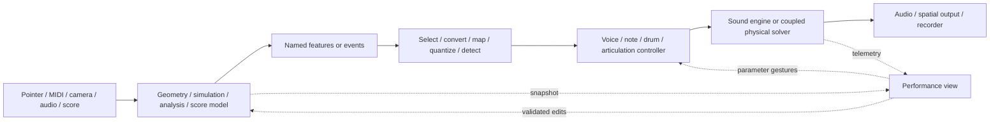

# Morphazoid abstraction atlas for AudioBrain

The earlier node table was a shortlist. This survey covers the whole committed browser-page collection and expands the candidate vocabulary well beyond Shapes, L-Systems and Graphs. **Preserve complete instruments first; expose reusable parts without erasing their original behavior.**

- [Every source page and its proposed boundaries](MORPHAZOID_PAGE_MATRIX.md)
- [Complete selected registries: modules, adapters, features, models and reference techniques](MORPHAZOID_SOURCE_REGISTRIES.md)
- [Machine-readable coverage, controls, source hashes and registry metadata](MORPHAZOID_ABSTRACTION_SURVEY.json)
- [The 34 nodes currently shipped and the earlier design options](NODE_ABSTRACTION_REVIEW.md)

## What “exhaustive” means here

The source is pinned to Morphazoid `a67df8f44567b6fe457f2482f0084b24af249d1d`. All **176 authored HTML pages** are accounted for: **149 instrument/workbench surfaces**, **13 redirects**, **9 reference pages**, **1 catalogue**, and **4 planned collaboration surfaces**. Some instrument surfaces share an engine. All **147 navigation entries** map to a page; pages outside navigation are included too. Generated `dist-wax` copies and uncommitted work are excluded.

| Inventory within the larger apps | Coverage |
| --- | --- |
| Modular Shader Synth | All 125 registered modules, with source ports, parameters and execution metadata |
| Morphazoid Composer | All 38 primitives, including converters, monitors and nested-graph building blocks |
| Morphazoidical | All 76 feature descriptors, including units, cadence, availability and normalization |
| Shader DSP reference | All 145 reference techniques and their separate 145-entry playground coverage map |
| Mouthophones | All 19 instrument configurations and all six source/resonator topologies |
| Syrinx source family | All four source-model IDs; animal/call presets remain a separate layer |
| Physical Sounds | All five model definitions, including families not represented by a separately named current page |
| Recursion | All six study definitions, including studies beyond the visible Fuzzy Donut entry |
| srtuss Master | All eight decomposed program families and their 48 named parts |
| Acoustic Manifold | All 68 analysis profiles, distinguished from the much smaller set of resynthesis implementations |
| SIMD Synth | All eight source models and eight further option registries: combiners, shapers, filters, filter routes, effects, modulation sources/destinations and scales |
| Shared UI | All 36 source files under `src/ui/`, plus domain editors identified in the page matrix |

The source advanced during this audit from `0774e1774b3da1ae9c110048e53fed546da2efd7` to the revision above. The added SIMD Synth page and Roach contact/displacement percussion were incorporated; the earlier survey edition is recorded in the JSON audit history.

This establishes exhaustive **page coverage and membership of the listed registries**. It does not certify every internal DSP branch, dynamic control, asset, sound, gesture, native plugin or preset reconstruction. The matrix records candidate seams grounded in catalogue descriptions, entry modules and selected implementation review. Each extraction still needs its own behavior audit. The JSON retains static HTML controls; generated controls also require their owning module/registry to be read.

The existing preset archive remains pinned to `769b348ab0ee3a8a57e1dd703d0c5cda211e5090`: 1,479 records in 126 banks. This broader source survey neither replaces that archive nor implies its newer source content is already archived or playable in AudioBrain. New discoveries become additive preservation requirements; they do not erase old ones.

## The architecture should support several kinds of instrument

The geometry pattern is one specialization of a broader pattern:



A complete instrument can wrap this graph and expose its original front panel. Expanding it reveals reusable nodes while retaining the same instance, internal objects, voices, presets and bindings. The view observes the model; moving a shape or tongue edits the owning parameters. Resizing a panel never changes musical coordinates.

**Physical feedback needs a different boundary from a feature cable.** A tract loads its source; pressure affects valves; valves change flow; flow changes pressure. Breaking that loop into ordinary once-per-frame control nodes changes the instrument. Keep the coupled solver inside one runtime node initially. It can expose an editable internal organ graph and telemetry. Truly patchable acoustic junctions later require an explicit physical network compiled into one solver, with declared units, propagation, integration and stability rules.

A second important distinction is **model state versus score versus sound**. A tongue shape is configuration; a time-varying tongue gesture is a score; breath pressure is a control trajectory; tract pressure waves are solver state; the resulting waveform is audio. These must not all become anonymous arrays of numbers.

## Candidate node families and their source boundaries

These names are discussion labels, not new registry kinds or promises that the nodes already exist. The page matrix contains the per-page detail, including variants and aliases.

### Geometry, fractals and fields

| Candidate reusable parts | Sources | Boundary / contract |
| --- | --- | --- |
| Contour, Star, Circle, Polyhedron, Hyperpolyhedron | [Shape][shape], [Shapes][shapes], [Solid][solid], [Hyper][hyper] | Parameters → identified contour/mesh with original dimension and topology |
| Affine Transform, 3D/4D Rotation, Projection | Shape/Solid/Hyper; [Paths][paths] | Geometry + transform → geometry; display projection preserves model coordinates |
| Point Reader, Line Reader, Radar Reader, Plane Reader, Reader Bank | Shape/Solid/Hyper; [Morphazoidical][workbench] | Geometry + identified reader state → contacts; independent phase, position, direction and count |
| Contact Tracker, Feature Select, Feature Inspector | [Feature registry][features] | Stable contact/event identities plus named, typed, unit-bearing features; unavailable is null |
| Nonorientable Surface, Seam/Lap Tracker | [Möbius][moebius], [Klein Bottle][klein] | Parametric mesh → sheet-aware intersections, seam orientation and lap parity |
| Isohedral Tile, Prototile Editor, Tile Color/Class Mapper, Log-Polar Warp | [Tiles][tiles], [Lattice][lattice], [Spiral][spiral] and drum variants | Legal tile model → transformed edges → classified contacts; preserve lattice coordinates |
| Penrose Presentations, Physical Edge Deduplicator | [Penrose][penrose] | Tiling presentation → real edge identity → sustain/strike events |
| Wallpaper Group, Similarity Recursion, Hyperbolic Reflection, Contour Extractor | [Escher][escher] | Motif + symmetry/domain → identified playable contours |
| Grammar, Turtle, Generation Tree, Branch Frontier | [L-Systems][lsystems] and individual synth/drum pages | Symbols → generation-aware branches → timed encounters; preserve pen-up and branch ancestry |
| Space-Filling Path, Seeded Walk, Arc-Length Reader | [Paths][paths] | Rule/seed → hierarchical path → sampled position/tangent; separate drawing time and distance |
| Julia Boundary, Mandelbrot Escape Field, Stripe Reader | [Julia][julia], [Striped Staircase][staircase] | Complex-domain field or boundary → turn/escape-depth/dwell features |
| Cantor Masks, Sierpiński Field, Occupied-Run Detector | [Cantor Lock][cantor], [Linebreaker][linebreaker] | Addressed masks/fields → runs, gaps, retained energy and leakage |
| Open Baker Map, Survivor Set, Finite Wave, Escape Flux | [Escape Dust][escape] | Separate classical and finite-wave states → survival/phase/escape events |
| Cellular Automaton, Gray-Scott Field, Flow Advection, Geometric Feedback | [Automatapoeia][automata], [Reaction-Diffusion][reaction], shader state modules | Persistent field + update rule → next state and features; no display-clock dependency |
| SDF Pattern/Logic, Voronoi, Truchet, Polar Fold, KIFS, Orbit Trap | [Shader modules][shader] | Field/domain operations → continuous samples or discrete region/edge events; keep the two interpretations explicit |
| Fourier/Epicycle Bank, Lissajous Ratio, Orbital Slice | [Fourier Epicycles][fourier], [Lissajous][lissajous], [Atomic Orbitals][orbitals] | Coefficients/ratios/field sign → geometry and identified partial controls |

### Vocal, anatomical and biological instruments

| Candidate reusable parts | Sources | Boundary / contract |
| --- | --- | --- |
| Signed Breath, Pressure Gesture, Lung Bank | [Mouthophones][mouthophones], [Harmonica][harmonica], [Monstrozoid][monstrozoid] | Time/gesture → explicitly signed pressure or normalized breath control; don't silently equate the units |
| Two-Mass Folds, Bilateral Bird Labia, Frog Membrane, Jet Whistle | [Syrinx source models][syrinxmodels] | Source configuration + articulation + acoustic load → audio/state inside a compatible solver |
| Vocal-Tract Profile, Oral/Nasal Branches, Mouth Radiation, Pressure Gland | [Throatazoid][throatazoid], [Syrinx][syrinx] | Section geometry/topology + excitation → coupled tract solution and telemetry |
| Tongue Anatomy, Tongue Motion, Constriction Adapter | [Tongued Beasts][tongued], [tongue geometry][tonguemath], [tongue gestures][tonguemotion] | Anatomical pose → airway deformation; tongue gesture score remains independently editable |
| Call Contour Score, Bilateral Balance, Articulation Controller | [Hybrinx][hybrinx], [Syrinx][syrinx], [Creaturazoid][creaturazoid] | Identified pressure/pitch/closure/cavity/roughness trajectories → sustained or transient calls |
| Multiple Source/Mouth Router, Organ Layout | [Monstrozoid][monstrozoid], [Hyper-Syrinx][hypersyrinx] | Topology/configuration is reusable; the latter's current oscillator/filter implementation is a proxy, not the former's physical engine |
| Model Morph, Microphone Formant Follower, Letter Mutation | [Morphynx][morphynx] | Persistent engine states + morph controls + analysis features → continuous voice; preserve both source identities |
| Coupled Larynx, Propagation Scale, Mouth Genome, Robot Glands, Wormhole Manifold | [Alien Larynx][alien] | Five distinct extensions to a persistent airway; route buffers and pressure feedback stay solver-owned |
| Overtone Focus, Dual Constriction, Ventricular Fold Divider | [Throat Singing][throatsinging] | Drone and selected harmonic are different musical controls over one airway |
| Phonic Lip, Spermaceti Path, Baleen Source, Blowhole Valve, Listening Probe | [Blowhole][blowhole] | Separate source families, propagation and valve function; expose source-specific controls and the implementation's modeling limits |
| Face Gesture, Plosive, Frication, Click, Cheek, Tooth Tine | [Hiccup Head][hiccup] | Gesture lifecycle + mutable mouth geometry → persistent tract excitation; maintain long holds, exclusive gestures and release states |
| Compartment, Peristalsis, Fluid Mixture, Tissue Valve, Bubble Cloud, Abdominal Modes | [Digestazoid][digest] | Anatomy/mixture/gesture → coupled pressure/flow model → event and audio outputs; these are meaningful internal modules, not independent frame-rate effects |
| String-Wind, Free-Reed Bank, Lip-Reed Bore, Edge-Tone Flute, Mouth Bow, Jaw Reed | [Mouthophones topologies][breathmodels] | Six different exciter/resonator arrangements; preserve all 19 configurations and source-declared approximation tiers |
| Cantilever Reed, Tine Pull/Pluck, Breath Load, Mouth Harmonic Selector | [Jaw Harp][jawharp], [Jaw Jam][jawjam] | Fixed reed pitch and moving mouth resonance remain distinct; controller owns pluck/sustain/rest |
| Paired Blow/Draw Reeds, Hole Aperture, Tongue Block, Bend Technique, Hand Cavity | [Harmonica][harmonica] | Preserve individual reed/slot identity and continuous technique, not only MIDI note number |
| Animal Body Gesture, Foot Contact, Wing/Feeding/Scrape Exciter | [Creaturazoid][creaturazoid], [Quadruped][quadruped], [Roach Synth][roach] | Model events carry body-part identity, force/velocity and articulation into chosen sound engines |
| Carrier/Pulse/Chirp Analyzer, Wing-Mode Resynthesizer | [Crickets][crickets] | Recording → estimated carrier and rhythm → source-specific synthesis; keep reference comparison and uncertainty |
| Syllable/Pitch Analyzer, Acoustic Occurrence Graph, Profile Selector | [Strophe Lab][birdsong], [Nightingale Manifold][nightingale], [Acoustic Manifold][acoustic] | Audio spans and descriptors → event occurrences/graph → playback or resynthesis; profiles do not identify anatomy or species |

### Physical sound, language, scores and interaction

| Candidate reusable parts | Sources | Boundary / contract |
| --- | --- | --- |
| Karplus Excitation, Tuned String, Loss/Dispersion, Pickup, Body, Sympathetic Bank | [Karplus Strong][karplus] | Note/strike + string configuration → retained delay-state synthesis; preserve feedback topology |
| Microtonal Carpet, Cell Crossing, Seeded Timbre, One-Shot ADSR | [Karplus Carpet][carpet] | Pointer/position → identified cell attack and fresh Karplus synthesis; no sample-grain substitution |
| Continuous Percussion Morph, FM Kit, Sample Kit, Physical Drum Bank | [Rattlesnake][rattlesnake], [FM Drums][fmdrums], [Sample Drums][samples], [Graph Drums][graphdrums] | Abstract strike contract with explicit engine/kit choice; continuous frequency is not a discrete slot index |
| Particle Cabinet, Impact Ecology, Modal Object, Bowed Object, Airflow Object | [Physical Sounds definitions][physical] | Material, excitation and modal configuration → family-specific runtime; five separate model definitions |
| Tooth Picker, Spatial Strike, Modal JSON Adapter, Modal Bank | [Dentaphone][dentaphone], [SIMD Resonator][simdresonator] | Identity/strike position/hardness + modal frequencies/decays → audio; retain accelerators as backend metadata |
| Paddle/Caisson Driver, Wave State, Spray/Bubble/Slap/Whirlpool Exciters | [Wave Pool][wavepool] | Slow physical scene → distinct time-stamped sound lanes, with coupling preserved where implemented |
| Text to Phones, Syllable Score, Phoneme Join, Typing Dynamics | [Pink Trombonazoid][pink], [Spelling Synthesizer][spelling], [Vocalzoid][vocalzoid] | Text edits/phonemes → score/articulation; keep pronunciation fallbacks, language assumptions and timing |
| Physical Phone Voice, Sustained Phone Sample, Vocoder, UTAU Bank Adapter | Same vocal pages | Different engine/asset contracts; retain pitch metadata, sustain windows, aliases and provenance |
| Nested Envelope, Slope Inheritance, Automation Lane | [Enveloper][enveloper], Hybrinx, Pink Trombonazoid | Parent/child score time → parameter curves and event ownership; not one generic ADSR |
| Cube/Tile/Tesseract Score, Visibility Gate, Cell Reader | [Rubix][rubix], [Hyper Rubix][hyperrubix], [Sliding Puzzle][puzzle] | Stable sticker/cell identity → read events; hidden/silent cell rules remain musical behavior |
| Hocket Distributor, Phase Bank, Pulse Ownership | [Hocket Luigi][hocket], [Composer][composer] | Composite rhythm → owned voice pulses and gaps; preserve collisions and intentional rests |
| Algorithm Trace, Operation/Event Adapter | [Sorting][sorting], [Dijkstra][dijkstra], Hanoi, Minimax, N-Queens, Euclid, Prime Sieve | Expose comparisons, transfers, pruning, conflicts and remainders as different events; final state alone loses the score |
| State/Probability/Phase Observer | Order Tones, Bell Square, Entanglement Dance, Quantum Square Dance, Annealogue | Browser model state → explicitly named observables → musical mapping; no physical quantum execution implied |
| Collision, Contact Network, Hull/Delaunay, Constraint Solver, Surface Metric | Physics pages in [the full matrix](MORPHAZOID_PAGE_MATRIX.md#motion-and-interaction) | Fixed-step model → features/events; resting contact, collision impulse and topology change are different events |
| Gesture Recorder, Path Reader, Reflection Bank, Painted Field | [Playhead Paint][paint], Rattle Snake Skin | Preserve time, distance, pressure/width/color, pen-up gaps and transformed-child identity |
| Camera Tracker, Region Editor, Crossing/Hold Detector | [Gesturama][gesturama] | Tracked observations → region features/events → drums, resonant pads, samples or Karplus harp |
| Rig/Pose, Gait, Juggling, Flock, Ship Navigation, Yo-Yo | Roach, Quadruped, Puggler, Boidzoid, Vector Flight, Yoyodyne | Separate model-specific interaction and features from audio choices; preserve persistent body/object IDs |

### Shepard, recursive DSP, spectral processing and infrastructure

| Candidate reusable parts | Sources | Boundary / contract |
| --- | --- | --- |
| Cyclic Pitch Mapper, Shepard Bank, Spectral Window | [Shepard–Risset][shepard], [Julia][julia], [Shape sound engine][audio] | A geometry adapter produces pitch trajectories; the Shepard bank owns overlapping octave voices and register windows |
| Risset Rate Bank, Rhythm/Pitch Fusion, Octave Gate Hierarchy | [Drum Roll Please][drumroll], Ouroborousel, Ourorourobouroboros | Tempo layers, pulse phases and slow nested gates remain inspectable and independent |
| Shepard Percussion, Crossed Pitch/Tempo Banks | [Ouroboros][ouroboros], [Ouroboros Borealis][borealis] | Independent illusory pitch and tempo directions/rates over a particular percussion body |
| Moiré Coincidence, Frequency Fabric, Spectral Propagation | RISSET-MOIRE, [Fabric Filter][fabric] | Geometry intersections or physical frequency-field state → weights/processing; preserve direct grabs and propagating motion |
| Moving Delay Head, Grain Window, Pitch-Rate Trajectory | [Sandy Syrup][sandy], [Candy Coil][candy] | Audio history + identified trajectories → read heads; head movement is audible DSP |
| Log Spectrum, Band Follower, Consonant Exciter, Shepard Resynthesizer | [Slippery Resynthesis][slippery] | Audio → analysis frames → separately controlled resynthesis; do not conflate analysis and generated spectrum |
| Recursive/Cascading/Chaotic FM and PM, Weierstrass Bank | [Recursive DSP pages](MORPHAZOID_PAGE_MATRIX.md#recursive-and-nonlinear-audio) | Preserve separate frequency/phase semantics, nonlinear integration, recursion depth and transitions |
| Fuzzy Donut, Spectral Möbius, Filter Hydra, Cantor Delay, Convolution Maw, Phase Labyrinth | [Recursion studies][recursion] | Buffer/FFT/phase histories and generation plans are different from recursive geometric paths |
| Branch Audio Processor, Generation Bank, Graph Audio Router | [L-Systems][lsystems], [L-system Delay][lmic], [Graph Delay][graphdelay] | Explicit audio histories, route delays and feedback; cannot be replaced by a note-producing graph |
| Loop Recorder, Ring Player, Reverse/Transpose, Stem Export | [Lumber][lumber], [Surround for Safety][surround] | Immutable asset references + editable playback state; recorders own session resources and capture clocks |
| Spectrum, Frequency Tracker, Level, Audio-to-FFT, Frequency/MIDI/Amplitude Converters | [Composer primitives][composer] | Typed conversion with confidence, units, channel and note ownership; all source converters listed in the registry appendix |
| Shader Module Host, Stateful Field/Spectrum Processor, Asset Loader | [All 125 shader modules][shader] | Separate analytic sample-parallel expressions, history-based effects and persistent-state solvers; declare capabilities and resource costs |
| Configurable Two-Source Voice, Combiner, Filter Router, Modulation Matrix, Dual FX | [SIMD Synth][simdsynth] | Eight source models, four modulation routes and an eight-voice engine; preserve IDs, source-specific semantics and runtime-owned feedback |
| WGSL Acid/Chip/Program Voice, SIMD Acid/Modal Backend | WebGPU 303, SIMD 303, Chiptune, srtuss, SIMD Resonator | Backend changes are explicit and independently validated; source programs, parameters and attribution remain intact |
| Speaker Layout, Position-to-Gains, Output Device, Channel Calibrator, Stem Recorder | [Surround for Safety][surround] | Preserve actual gain law, channel order, LFE, stereo preview and discrete device capabilities |
| Expandable Instrument, Public Port, Performance Binding, Preset Reconstruction | [Composer][composer], [AudioBrain architecture](../docs/ARCHITECTURE.md) | One state/identity graph at different presentation depths; source origin and instance identity are separate |
| Worklet/Worker/External Processor Adapter, Host Transport/MIDI | Plugazoid, FFmpeg Wasm, Micromorph, WAX | Declare timing, queue bounds, readiness and teardown; connections and credentials are session resources |
| Shared Room, Stage Handoff, Remote Performance | Four room/roulette pages | **Future candidates only:** current pages are proposals, not working collaboration engines |

## UI elements are part of the abstraction inventory

A useful rule is: a control binds to an owner; a generator produces data; an observer displays data. A button can trigger an event node or bind an action, but every button does not need its own DSP node. A specialized canvas may be a reusable performance view without owning a second copy of instrument state.

| UI / interaction component | Reuse from | What it binds or emits |
| --- | --- | --- |
| Slider, range/number field, stepper, select, choice switch, option cards | [Shared UI][ui] | Stable node/parameter binding, declared range/unit, native input/change semantics |
| Audio strip, MIDI status, level meter, signal monitor, status readout | Shared UI patterns; Composer | Session commands or runtime observations; no device handles in project JSON |
| Shape handles, independent playhead handles, rotation/phase controls | Shapes, Morphazoidical | Model-space edit commands; distinguish shape motion, reader motion and camera motion |
| Geometry/feature probe with source selection | Morphazoidical's registry/atlas | Feature ID + object/contact selector + value/availability; reusable before any musical mapping |
| Graph node/edge editor, route switch, organ graph editor | Graph instruments, Composer, Monstrozoid | Stable topology edits; acoustic connections remain distinguishable from musical event routing |
| Curve/envelope editor, call contour lane, nested time blocks | Mapping curves, Enveloper, Hybrinx, Pink Trombonazoid | Authored curve/score data with units, duration, interpolation and binding target |
| Anatomical section, tongue handles, mouth aperture, breath pad | Throatazoid, Tongued Beasts, Harmonica, Jaw Harp, Digestazoid | Physical configuration or gesture commands; normalized pointer position is converted explicitly |
| Face/tooth/body-part picker, pose/gait editor | Hiccup Head, Dentaphone, Roach, Quadruped | Stable part IDs, gesture phase/force and owned parameter edits |
| XY/polar pad, freehand path, time-frequency paint surface | Playhead Paint, Rattle Snake Skin, Karplus Carpet | Identified continuous gestures or timestamped crossings; retain cancellation and release |
| Camera mask, tracked-color display, zone editor | Gesturama | Separate observation data from editable detection regions |
| Phoneme blocks, note/syllable editor, text keyboard | Pink Trombonazoid, Vocalzoid, Spelling Synthesizer | Score edits, note identity, typing dynamics and pronunciation state |
| Waveform/ring editor, sample pad, asset selector | Lumber, Sample Drums, Vocalzoid | Asset reference plus slice/loop/alias settings; source audio remains separately stored |
| Spectral fabric, feature manifold, strophe timeline | Fabric Filter, Acoustic/Nightingale Manifolds | Selection/force or occurrence route edits with original time ranges and feature provenance |
| Speaker array/3D source editor and calibration panel | Surround for Safety | Layout/channel/source configuration and explicit device-session commands |
| Performance layout and reusable instrument panel | AudioBrain + Composer patterns | Bind the same public parameters/views to several placements; collapse/expand preserves state |

For preservation, every dynamic panel and canvas action needs a control inventory including Graph/Inspector and Perform access, defaults, ranges, choices, gestures and keyboard alternatives. Static HTML extraction alone cannot establish that inventory.

## Proposed contracts

These are design sketches, not types currently accepted by AudioBrain's compiler. Today the shipped signal families remain `transport.state`, `geometry.path`, `geometry.features`, `music.voices`, `event.feature`, `event.note`, `geometry.graph`, `audio.block`, `control.f32`, and `text.utf8`. A generic trigger, spectrum or physical-network port needs a real registry/compiler/runtime implementation.

| Contract name used in the matrix | Essential information |
| --- | --- |
| Geometry | Schema/version, geometry/object IDs, original dimension and coordinate space, topology, logical element IDs, attributes, transform and revision; typed variants for path, mesh and graph |
| Reader | Reader ID/type, referenced geometry ID, position/orientation, phase, direction, speed and their units, traversal policy; independent from display camera |
| Field | Domain and coordinate transform, scalar/vector/complex/channel meaning, dimensions/resolution, sample spacing, boundary conditions, state epoch, resource ownership and update clock |
| Features | Feature ID, subject/object/contact ID, timestamp and clock, typed value or null, unit, coordinate space, availability/reason, normalization descriptor and optional confidence |
| Events | Event/source/subject IDs, enter/exit/cross/impact/operation kind, onset and clock, sequence/epoch, payload, direction and explicit end/cancel semantics where applicable |
| Music | Owned voice/note/strike ID, source lineage, pitch representation (Hz, cents or note), time, gate/duration, articulation/expression and release policy; channel/bus as needed |
| Score | Stable lane/event IDs, time basis, duration/loop, curves and interpolation, units, parent time mapping, precedence and target bindings; no UI-only duplicate values |
| Model | Versioned physical/model configuration, units and normalization, component/port IDs, solver family and limits. Live pressure waves, delay memories and integrator state remain solver-owned; UI receives telemetry snapshots |
| Spectrum | Sample rate, FFT/window/hop, frequency scale, bin layout, complex/magnitude/power meaning, normalization, time origin, latency and confidence/voicing where supplied |
| Audio | Bus/channel layout, sample rate, sample-time origin, latency and lifecycle; graph metadata references runtime buffers/resources rather than serializing AudioNodes |
| Asset | Content identity/hash, format/rate/channels, provenance/license, source-pitch/loop/alias metadata and readiness; runtime URL and decoded buffers are not portable project state |
| View | View ID, model or public binding paths, instance-scoped selection, model-to-display transform, layout, gesture commands and accessibility; view updates never schedule audio attacks |

Every conversion should expose its policy. Radians-to-cyclic-pitch, cents-to-Hz, signed-pressure-to-normalized-control, spectrum-to-amplitude, edge-to-trigger and trigger-plus-pitch-to-note are different nodes or named adapter subpatches. Include feature selection, identity-based joins, normalization, curves, hysteresis, smoothing, quantization, tuning, rate conversion and event lifecycle where needed.

A controller joins values by **subject identity and time**, not their position in two arrays. Missing/expired features need an explicit hold/release policy. A repeated trigger needs a chosen retrigger policy. A source note-off cannot release somebody else's note. Clock conversion must declare lookahead/latency and stale-event handling. Source feature cadence may be an analysis frame; migrating it into AudioBrain does not authorize scheduling sound from rendering callbacks.

## What must remain different

- A vowel-weighted additive bank is not a vocal-tract waveguide. Hyper-Syrinx and Adaptive Airway currently use simplified Web Audio proxies despite their anatomical interfaces. Preserve them accurately; do not claim their controls certify the physical models used by other pages.
- A shader analytic pluck is not a feedback-delay Karplus string. A windowed oscillator grain is not a sample granulator. The shader registry has separate analytic, uploaded-wavetable and sampler/stateful paths.
- An analytic modal-bank expression, a bounded stateful modal bank and a physical coupled resonator have different state/resource contracts. The apparent scale of a visual does not prove independent simulated objects.
- Shepard pitch, Risset rate, register wrapping, moiré coincidences and moving audio read heads are related ideas with different implementations and controls.
- Recursive geometry, recursive score timing, FM/PM recursion, recursive audio buffers and feedback networks need separate contracts.
- Acoustic profiles describe analysis strategies. A PCA coordinate is not a biological identity; descriptor resynthesis does not reconstruct anatomy. Keep the source's own non-claims.
- Model names, presets and registries are evidence of configuration, not proof that AudioBrain currently implements their sound.

## A preservation-driven implementation sequence

1. **Keep the inventory additive.** Use this page survey as the index of requirements; retain the earlier archive/parity floor. When Morphazoid advances, report new/changed/removed pages and registries before revising coverage. Include pages not in the menu and source-only model definitions.
2. **Build the reusable adapter/view foundation with real consumers.** Feature descriptors from Morphazoidical, object/contact selectors, typed mapping, explicit trigger and voice/note/drum controllers, identity-preserving subpatches and public performance bindings. Use one geometry instrument and one anatomical or physical instrument to avoid a geometry-only framework.
3. **Preserve a complete source engine behind each first wrapper.** Keep the original gestures, presets, control values, routes, sound modes and state behavior. Expose stable inputs/outputs and telemetry; do not replace a solver merely to get a uniform node shape.
4. **Prove the difficult seams with contrasting patches.** Suggested straightforward Morphazoid-style examples: **Shape Shepard** (independent readers → turn/pitch adapter → Shepard bank), **Tongue Breath** (gesture lanes → tongue/pressure controls → persistent tract), **Karplus Carpet** (spatial cells → deterministic strikes → Karplus bank), **Fractal Branches** (grammar/generations → reader → notes or branch audio), **Gut Pressure** (direct body gestures → coupled compartments → bubble/valve sound), and **Cricket Paths** (carrier/chirp analysis → occurrence route → wing-model resynthesis). These are proposed examples, not installed presets.
5. **Extract a part when its boundary is demonstrated.** Preserve the complete wrapper while replacing internal duplicated code with the reusable implementation. Shared UI components should have two real consumers or an established project-wide contract. Physical internal patching waits for solver-domain compilation.
6. **Validate each promoted capability.** Record original default/range/choices; preset and saved-state round trips; duplicate-instance independence; contact/part/voice identity; direction/phase continuity; actual audio changes and releases; timing under UI load; resource cleanup; and named listening/touch/device acceptance. A passing metadata check never upgrades sound parity.

The release gate for an imported capability remains the existing [feature preservation contract](../docs/FEATURE_PARITY.md) and [preset archive contract](../docs/PRESET_ARCHIVE.md). This survey adds breadth to the design discussion; it does not relax those requirements.

## Recheck coverage

From AudioBrain, with Node 22 or newer:

```sh
node scripts/check-morphazoid-survey.mjs --source-root /home/blechdom/creative/morphazoid
node scripts/check-morphazoid-survey.mjs --source-root /home/blechdom/creative/morphazoid --compare-head
```

The first checks the recorded revision, authored page coverage, navigation membership, selected registry membership and hashes. The second additionally reports committed source drift and fails if the recorded survey needs a re-audit. Neither command changes the original frozen preset/parity baselines or includes uncommitted source work.

[shape]: https://github.com/blechdom/morphazoid/blob/a67df8f44567b6fe457f2482f0084b24af249d1d/shape.html
[shapes]: https://github.com/blechdom/morphazoid/blob/a67df8f44567b6fe457f2482f0084b24af249d1d/shapes.html
[solid]: https://github.com/blechdom/morphazoid/blob/a67df8f44567b6fe457f2482f0084b24af249d1d/solid.html
[hyper]: https://github.com/blechdom/morphazoid/blob/a67df8f44567b6fe457f2482f0084b24af249d1d/hyper.html
[paths]: https://github.com/blechdom/morphazoid/blob/a67df8f44567b6fe457f2482f0084b24af249d1d/paths.html
[workbench]: https://github.com/blechdom/morphazoid/blob/a67df8f44567b6fe457f2482f0084b24af249d1d/morphazoidical/index.html
[features]: https://github.com/blechdom/morphazoid/blob/a67df8f44567b6fe457f2482f0084b24af249d1d/morphazoidical/feature-registry.js
[moebius]: https://github.com/blechdom/morphazoid/blob/a67df8f44567b6fe457f2482f0084b24af249d1d/moebius.html
[klein]: https://github.com/blechdom/morphazoid/blob/a67df8f44567b6fe457f2482f0084b24af249d1d/klein-bottle.html
[tiles]: https://github.com/blechdom/morphazoid/blob/a67df8f44567b6fe457f2482f0084b24af249d1d/tiles.html
[lattice]: https://github.com/blechdom/morphazoid/blob/a67df8f44567b6fe457f2482f0084b24af249d1d/lattice.html
[spiral]: https://github.com/blechdom/morphazoid/blob/a67df8f44567b6fe457f2482f0084b24af249d1d/spiral.html
[penrose]: https://github.com/blechdom/morphazoid/blob/a67df8f44567b6fe457f2482f0084b24af249d1d/penrose-tilings.html
[escher]: https://github.com/blechdom/morphazoid/blob/a67df8f44567b6fe457f2482f0084b24af249d1d/escher-tessellation.html
[lsystems]: https://github.com/blechdom/morphazoid/blob/a67df8f44567b6fe457f2482f0084b24af249d1d/l-systems.html
[julia]: https://github.com/blechdom/morphazoid/blob/a67df8f44567b6fe457f2482f0084b24af249d1d/julia.html
[staircase]: https://github.com/blechdom/morphazoid/blob/a67df8f44567b6fe457f2482f0084b24af249d1d/striped-staircase.html
[cantor]: https://github.com/blechdom/morphazoid/blob/a67df8f44567b6fe457f2482f0084b24af249d1d/cantor-lock.html
[linebreaker]: https://github.com/blechdom/morphazoid/blob/a67df8f44567b6fe457f2482f0084b24af249d1d/linebreaker.html
[escape]: https://github.com/blechdom/morphazoid/blob/a67df8f44567b6fe457f2482f0084b24af249d1d/escape-dust.html
[automata]: https://github.com/blechdom/morphazoid/blob/a67df8f44567b6fe457f2482f0084b24af249d1d/automatapoeia.html
[reaction]: https://github.com/blechdom/morphazoid/blob/a67df8f44567b6fe457f2482f0084b24af249d1d/reaction-diffusion.html
[shader]: https://github.com/blechdom/morphazoid/blob/a67df8f44567b6fe457f2482f0084b24af249d1d/src/shader-synth-playground.js
[fourier]: https://github.com/blechdom/morphazoid/blob/a67df8f44567b6fe457f2482f0084b24af249d1d/fourier-epicycles.html
[lissajous]: https://github.com/blechdom/morphazoid/blob/a67df8f44567b6fe457f2482f0084b24af249d1d/lissajous-orbits.html
[orbitals]: https://github.com/blechdom/morphazoid/blob/a67df8f44567b6fe457f2482f0084b24af249d1d/atomic-orbitals.html
[mouthophones]: https://github.com/blechdom/morphazoid/blob/a67df8f44567b6fe457f2482f0084b24af249d1d/mouthophones.html
[harmonica]: https://github.com/blechdom/morphazoid/blob/a67df8f44567b6fe457f2482f0084b24af249d1d/harmonica.html
[monstrozoid]: https://github.com/blechdom/morphazoid/blob/a67df8f44567b6fe457f2482f0084b24af249d1d/monstrozoid.html
[syrinxmodels]: https://github.com/blechdom/morphazoid/blob/a67df8f44567b6fe457f2482f0084b24af249d1d/src/syrinx-source-models.js
[throatazoid]: https://github.com/blechdom/morphazoid/blob/a67df8f44567b6fe457f2482f0084b24af249d1d/throatazoid.html
[syrinx]: https://github.com/blechdom/morphazoid/blob/a67df8f44567b6fe457f2482f0084b24af249d1d/syrinx.html
[tongued]: https://github.com/blechdom/morphazoid/blob/a67df8f44567b6fe457f2482f0084b24af249d1d/tongued-beasts.html
[tonguemath]: https://github.com/blechdom/morphazoid/blob/a67df8f44567b6fe457f2482f0084b24af249d1d/src/tongue-physics.js
[tonguemotion]: https://github.com/blechdom/morphazoid/blob/a67df8f44567b6fe457f2482f0084b24af249d1d/src/tongue-performance.js
[hybrinx]: https://github.com/blechdom/morphazoid/blob/a67df8f44567b6fe457f2482f0084b24af249d1d/hybrinx.html
[creaturazoid]: https://github.com/blechdom/morphazoid/blob/a67df8f44567b6fe457f2482f0084b24af249d1d/creaturazoid.html
[hypersyrinx]: https://github.com/blechdom/morphazoid/blob/a67df8f44567b6fe457f2482f0084b24af249d1d/hyper-syrinx.html
[morphynx]: https://github.com/blechdom/morphazoid/blob/a67df8f44567b6fe457f2482f0084b24af249d1d/morphynx.html
[alien]: https://github.com/blechdom/morphazoid/blob/a67df8f44567b6fe457f2482f0084b24af249d1d/alien-larynx.html
[throatsinging]: https://github.com/blechdom/morphazoid/blob/a67df8f44567b6fe457f2482f0084b24af249d1d/throat-singing.html
[blowhole]: https://github.com/blechdom/morphazoid/blob/a67df8f44567b6fe457f2482f0084b24af249d1d/blowhole.html
[hiccup]: https://github.com/blechdom/morphazoid/blob/a67df8f44567b6fe457f2482f0084b24af249d1d/hiccup-head.html
[digest]: https://github.com/blechdom/morphazoid/blob/a67df8f44567b6fe457f2482f0084b24af249d1d/digestazoid.html
[breathmodels]: https://github.com/blechdom/morphazoid/blob/a67df8f44567b6fe457f2482f0084b24af249d1d/src/breath-atlas.js
[jawharp]: https://github.com/blechdom/morphazoid/blob/a67df8f44567b6fe457f2482f0084b24af249d1d/jaw-harp.html
[jawjam]: https://github.com/blechdom/morphazoid/blob/a67df8f44567b6fe457f2482f0084b24af249d1d/jaw-jam.html
[quadruped]: https://github.com/blechdom/morphazoid/blob/a67df8f44567b6fe457f2482f0084b24af249d1d/quadruped.html
[roach]: https://github.com/blechdom/morphazoid/blob/a67df8f44567b6fe457f2482f0084b24af249d1d/roach-synth.html
[crickets]: https://github.com/blechdom/morphazoid/blob/a67df8f44567b6fe457f2482f0084b24af249d1d/crickets.html
[birdsong]: https://github.com/blechdom/morphazoid/blob/a67df8f44567b6fe457f2482f0084b24af249d1d/birdsong-lab.html
[nightingale]: https://github.com/blechdom/morphazoid/blob/a67df8f44567b6fe457f2482f0084b24af249d1d/nightingale-manifold.html
[acoustic]: https://github.com/blechdom/morphazoid/blob/a67df8f44567b6fe457f2482f0084b24af249d1d/acoustic-manifold.html
[karplus]: https://github.com/blechdom/morphazoid/blob/a67df8f44567b6fe457f2482f0084b24af249d1d/karplus-strong.html
[carpet]: https://github.com/blechdom/morphazoid/blob/a67df8f44567b6fe457f2482f0084b24af249d1d/karplus-carpet.html
[rattlesnake]: https://github.com/blechdom/morphazoid/blob/a67df8f44567b6fe457f2482f0084b24af249d1d/linear-drums.html
[fmdrums]: https://github.com/blechdom/morphazoid/blob/a67df8f44567b6fe457f2482f0084b24af249d1d/fm-drums.html
[samples]: https://github.com/blechdom/morphazoid/blob/a67df8f44567b6fe457f2482f0084b24af249d1d/sample-drums.html
[graphdrums]: https://github.com/blechdom/morphazoid/blob/a67df8f44567b6fe457f2482f0084b24af249d1d/graph-drums.html
[physical]: https://github.com/blechdom/morphazoid/blob/a67df8f44567b6fe457f2482f0084b24af249d1d/src/physical-sounds.js
[dentaphone]: https://github.com/blechdom/morphazoid/blob/a67df8f44567b6fe457f2482f0084b24af249d1d/dentaphone.html
[simdresonator]: https://github.com/blechdom/morphazoid/blob/a67df8f44567b6fe457f2482f0084b24af249d1d/simd-resonator.html
[wavepool]: https://github.com/blechdom/morphazoid/blob/a67df8f44567b6fe457f2482f0084b24af249d1d/wave-pool.html
[pink]: https://github.com/blechdom/morphazoid/blob/a67df8f44567b6fe457f2482f0084b24af249d1d/pink-trombonazoid.html
[spelling]: https://github.com/blechdom/morphazoid/blob/a67df8f44567b6fe457f2482f0084b24af249d1d/spelling-synthesizer.html
[vocalzoid]: https://github.com/blechdom/morphazoid/blob/a67df8f44567b6fe457f2482f0084b24af249d1d/vocalzoid.html
[enveloper]: https://github.com/blechdom/morphazoid/blob/a67df8f44567b6fe457f2482f0084b24af249d1d/enveloper.html
[rubix]: https://github.com/blechdom/morphazoid/blob/a67df8f44567b6fe457f2482f0084b24af249d1d/rubix.html
[hyperrubix]: https://github.com/blechdom/morphazoid/blob/a67df8f44567b6fe457f2482f0084b24af249d1d/hyper-rubix.html
[puzzle]: https://github.com/blechdom/morphazoid/blob/a67df8f44567b6fe457f2482f0084b24af249d1d/sliding-puzzle.html
[hocket]: https://github.com/blechdom/morphazoid/blob/a67df8f44567b6fe457f2482f0084b24af249d1d/hocket-loom.html
[composer]: https://github.com/blechdom/morphazoid/blob/a67df8f44567b6fe457f2482f0084b24af249d1d/src/constellation-composer.js
[sorting]: https://github.com/blechdom/morphazoid/blob/a67df8f44567b6fe457f2482f0084b24af249d1d/algorithmic-sequencers.html
[dijkstra]: https://github.com/blechdom/morphazoid/blob/a67df8f44567b6fe457f2482f0084b24af249d1d/dijkstra.html
[paint]: https://github.com/blechdom/morphazoid/blob/a67df8f44567b6fe457f2482f0084b24af249d1d/playhead-paint.html
[gesturama]: https://github.com/blechdom/morphazoid/blob/a67df8f44567b6fe457f2482f0084b24af249d1d/gesturama.html
[shepard]: https://github.com/blechdom/morphazoid/blob/a67df8f44567b6fe457f2482f0084b24af249d1d/shepard-risset.html
[audio]: https://github.com/blechdom/morphazoid/blob/a67df8f44567b6fe457f2482f0084b24af249d1d/src/audio.js
[drumroll]: https://github.com/blechdom/morphazoid/blob/a67df8f44567b6fe457f2482f0084b24af249d1d/drum-roll-please.html
[ouroboros]: https://github.com/blechdom/morphazoid/blob/a67df8f44567b6fe457f2482f0084b24af249d1d/ouroboros.html
[borealis]: https://github.com/blechdom/morphazoid/blob/a67df8f44567b6fe457f2482f0084b24af249d1d/ouroboros-borealis.html
[fabric]: https://github.com/blechdom/morphazoid/blob/a67df8f44567b6fe457f2482f0084b24af249d1d/moire-drone.html
[sandy]: https://github.com/blechdom/morphazoid/blob/a67df8f44567b6fe457f2482f0084b24af249d1d/sandy-syrup-delay.html
[candy]: https://github.com/blechdom/morphazoid/blob/a67df8f44567b6fe457f2482f0084b24af249d1d/candy-coil-delay.html
[slippery]: https://github.com/blechdom/morphazoid/blob/a67df8f44567b6fe457f2482f0084b24af249d1d/slippery-resynthesis.html
[recursion]: https://github.com/blechdom/morphazoid/blob/a67df8f44567b6fe457f2482f0084b24af249d1d/src/recursion.js
[lmic]: https://github.com/blechdom/morphazoid/blob/a67df8f44567b6fe457f2482f0084b24af249d1d/l-mic.html
[graphdelay]: https://github.com/blechdom/morphazoid/blob/a67df8f44567b6fe457f2482f0084b24af249d1d/graph-delay.html
[lumber]: https://github.com/blechdom/morphazoid/blob/a67df8f44567b6fe457f2482f0084b24af249d1d/lumber.html
[surround]: https://github.com/blechdom/morphazoid/blob/a67df8f44567b6fe457f2482f0084b24af249d1d/surround-field.html
[ui]: https://github.com/blechdom/morphazoid/blob/a67df8f44567b6fe457f2482f0084b24af249d1d/src/ui/index.js
[simdsynth]: https://github.com/blechdom/morphazoid/blob/a67df8f44567b6fe457f2482f0084b24af249d1d/simd-synth.html
