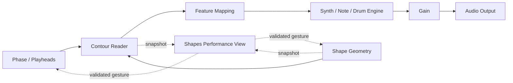
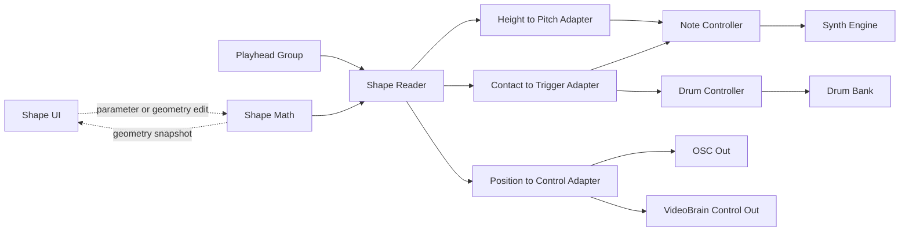

# AudioBrain node inventory and abstraction discussion

**Expanded survey:** this document's future-node table is a shortlist. The [Morphazoid abstraction atlas](MORPHAZOID_ABSTRACTION_ATLAS.md), [complete page matrix](MORPHAZOID_PAGE_MATRIX.md), and [source registries](MORPHAZOID_SOURCE_REGISTRIES.md) cover the wider collection, including anatomical voices, physical models, UI, Shepard systems and fractals. The shipped-node list below remains separate from those proposals.

Prepared 2026-09-11 for discussion. AudioBrain source: [0.3.0 / 6e47872](https://github.com/blechdom/audiobrain/blob/6e478725c07d9da7af4752a3b92e06014aa25bc4/contracts/operator-catalog.json). Morphazoid source inspected at [49f9bdc](https://github.com/blechdom/morphazoid/blob/49f9bdce361629c536a34dce24b2b021c9a3dc8c/README.md), with source functions, page wiring, Composer/Shader Synth catalogs and AudioBrain runtime checked directly. Existing uncommitted Morphazoid work is outside this assessment. This is a candidate design inventory, not a commitment to build every row.

AudioBrain has **34 registered, implemented nodes**. The 1,479 archived Morphazoid factory records are presets/components/defaults, not another 1,479 nodes. The archive is still the earlier fixed edition `769b348`; this review does not advance its baseline or claim the newer Roach Synth/Yoyodyne presets are already included.

**The useful abstraction is an instrument that can expose its parts.** Preserve a complete musical object and its performance surface, while giving the author access to geometry, motion, mapping, sound and I/O boundaries. A preset chooses and configures those parts; it should not need its original HTML page to exist.

## 1. Nodes that ship

Names and stable kinds below come from the production registry. Browser/hardware/session readiness remains separate from implementation. Morphazoid links identify the adapted domain source; AudioRack/control/device links identify AudioBrain-authored host implementations. Similar source-page labels do not establish complete source parity.

| # | Node / stable kind | What it currently does | Implementation / source |
| --- | --- | --- | --- |
| 1 | Transport `transport` | Tempo and transport time → transport state. Audio activation stays separate. | [GraphEvaluator](https://github.com/blechdom/audiobrain/blob/6e478725c07d9da7af4752a3b92e06014aa25bc4/src/runtime/GraphEvaluator.ts) |
| 2 | Shape Geometry `shapes.geometry` | Sides, curvature, rotation, position, stretch/skew → 2D contour. Stars and 3D/4D are still missing. | [Shapes](https://github.com/blechdom/morphazoid/blob/49f9bdce361629c536a34dce24b2b021c9a3dc8c/shapes.html); [geometry](https://github.com/blechdom/morphazoid/blob/49f9bdce361629c536a34dce24b2b021c9a3dc8c/src/geometry.js#L329); [state](https://github.com/blechdom/morphazoid/blob/49f9bdce361629c536a34dce24b2b021c9a3dc8c/src/shapes-state.js) |
| 3 | Shape Reader `shapes.reader` | Contour + transport → contacts from up to 12 independently positioned/directed point, line or radar heads. | [Shapes](https://github.com/blechdom/morphazoid/blob/49f9bdce361629c536a34dce24b2b021c9a3dc8c/shapes.html); [geometry](https://github.com/blechdom/morphazoid/blob/49f9bdce361629c536a34dce24b2b021c9a3dc8c/src/geometry.js#L329); [state](https://github.com/blechdom/morphazoid/blob/49f9bdce361629c536a34dce24b2b021c9a3dc8c/src/shapes-state.js) |
| 4 | Shape to Voices `shapes.mapping` | Contacts → continuous voice targets or note/FM-drum attacks. Sound mode lives here. | [Shapes](https://github.com/blechdom/morphazoid/blob/49f9bdce361629c536a34dce24b2b021c9a3dc8c/shapes.html); [geometry](https://github.com/blechdom/morphazoid/blob/49f9bdce361629c536a34dce24b2b021c9a3dc8c/src/geometry.js#L329); [state](https://github.com/blechdom/morphazoid/blob/49f9bdce361629c536a34dce24b2b021c9a3dc8c/src/shapes-state.js); [Shapes music mapping](https://github.com/blechdom/audiobrain/blob/6e478725c07d9da7af4752a3b92e06014aa25bc4/src/instruments/shapesMusic.ts) |
| 5 | Continuous Voice Bank `voice.continuous` | Voice targets + optional note/trigger events → audio; currently also hosts the Shapes notes/FM-kit path. | [AudioRack](https://github.com/blechdom/audiobrain/blob/6e478725c07d9da7af4752a3b92e06014aa25bc4/src/audio/AudioRack.ts); [source FM drum kit](https://github.com/blechdom/morphazoid/blob/49f9bdce361629c536a34dce24b2b021c9a3dc8c/src/fm-drums.js) |
| 6 | L-System Grammar `lsystem.grammar` | Axiom, rules, iterations → expanded symbols. All 11 original grammar defaults can be reconstructed. | [L-Systems](https://github.com/blechdom/morphazoid/blob/49f9bdce361629c536a34dce24b2b021c9a3dc8c/l-systems.html); [grammar / trace](https://github.com/blechdom/morphazoid/blob/49f9bdce361629c536a34dce24b2b021c9a3dc8c/src/l-system.js#L123) |
| 7 | L-System Geometry `lsystem.geometry` | Symbols → branch paths, with drawing/pen-up symbols, angles, taper and asymmetric turns. | [L-Systems](https://github.com/blechdom/morphazoid/blob/49f9bdce361629c536a34dce24b2b021c9a3dc8c/l-systems.html); [grammar / trace](https://github.com/blechdom/morphazoid/blob/49f9bdce361629c536a34dce24b2b021c9a3dc8c/src/l-system.js#L123) |
| 8 | L-System Frontier `lsystem.frontier` | Branch paths + transport → timed encounters. Current playback follows the final generation. | [L-Systems](https://github.com/blechdom/morphazoid/blob/49f9bdce361629c536a34dce24b2b021c9a3dc8c/l-systems.html); [grammar / trace](https://github.com/blechdom/morphazoid/blob/49f9bdce361629c536a34dce24b2b021c9a3dc8c/src/l-system.js#L123) |
| 9 | Branches to Notes `mapping.branchNotes` | Branch encounters → note events using cumulative turn and branch power sharing. | [L-Systems](https://github.com/blechdom/morphazoid/blob/49f9bdce361629c536a34dce24b2b021c9a3dc8c/l-systems.html); [grammar / trace](https://github.com/blechdom/morphazoid/blob/49f9bdce361629c536a34dce24b2b021c9a3dc8c/src/l-system.js#L123) |
| 10 | Polyphonic Voice Bank `voice.poly` | Note events → bounded polyphonic audio. Uses the native AudioBrain voice implementation. | [AudioRack](https://github.com/blechdom/audiobrain/blob/6e478725c07d9da7af4752a3b92e06014aa25bc4/src/audio/AudioRack.ts) |
| 11 | Graph Topology `graph.topology` | Seed and topology settings → directed graph. Ten original families plus retained AudioBrain layered mode. | [Graph Delay topology source](https://github.com/blechdom/morphazoid/blob/49f9bdce361629c536a34dce24b2b021c9a3dc8c/src/graph-delay.js#L488); [geometry adapter](https://github.com/blechdom/audiobrain/blob/6e478725c07d9da7af4752a3b92e06014aa25bc4/src/instruments/geometry.ts) |
| 12 | Graph Walk `graph.walk` | Directed graph + transport → bounded timed route encounters. Full source pulse/feedback controls remain incomplete. | [Graph Synth](https://github.com/blechdom/morphazoid/blob/49f9bdce361629c536a34dce24b2b021c9a3dc8c/graph-synth.html) / [Drums](https://github.com/blechdom/morphazoid/blob/49f9bdce361629c536a34dce24b2b021c9a3dc8c/graph-drums.html); [routing / mapping](https://github.com/blechdom/morphazoid/blob/49f9bdce361629c536a34dce24b2b021c9a3dc8c/src/graph-instruments.js#L372) |
| 13 | Graph to Notes `mapping.graphNotes` | Route encounters → notes using cumulative-turn pitch mapping. | [Graph Synth](https://github.com/blechdom/morphazoid/blob/49f9bdce361629c536a34dce24b2b021c9a3dc8c/graph-synth.html) / [Drums](https://github.com/blechdom/morphazoid/blob/49f9bdce361629c536a34dce24b2b021c9a3dc8c/graph-drums.html); [routing / mapping](https://github.com/blechdom/morphazoid/blob/49f9bdce361629c536a34dce24b2b021c9a3dc8c/src/graph-instruments.js#L372) |
| 14 | Graph Voice Bank `voice.graph` | Notes → decaying graph voices. Does not yet reproduce the complete original Graph Synth engine. | [AudioRack](https://github.com/blechdom/audiobrain/blob/6e478725c07d9da7af4752a3b92e06014aa25bc4/src/audio/AudioRack.ts); [source musical targets](https://github.com/blechdom/morphazoid/blob/49f9bdce361629c536a34dce24b2b021c9a3dc8c/src/graph-instruments.js#L847) |
| 15 | Gain `audio.gain` | Audio + gain in dB → smoothed audio level. | [AudioRack](https://github.com/blechdom/audiobrain/blob/6e478725c07d9da7af4752a3b92e06014aa25bc4/src/audio/AudioRack.ts) |
| 16 | Audio Output `audio.output` | Audio → selected host output. Importing a node never arms a device. | [AudioRack](https://github.com/blechdom/audiobrain/blob/6e478725c07d9da7af4752a3b92e06014aa25bc4/src/audio/AudioRack.ts) |
| 17 | Level Meter `analysis.level` | Audio → RMS level scalar and a meter. | [AudioRack](https://github.com/blechdom/audiobrain/blob/6e478725c07d9da7af4752a3b92e06014aa25bc4/src/audio/AudioRack.ts); [GraphEvaluator](https://github.com/blechdom/audiobrain/blob/6e478725c07d9da7af4752a3b92e06014aa25bc4/src/runtime/GraphEvaluator.ts) |
| 18 | Shapes View `view.shapes` | Contour + contacts → interactive Shapes graphic, with explicit parameter gestures. | [InstrumentView](https://github.com/blechdom/audiobrain/blob/6e478725c07d9da7af4752a3b92e06014aa25bc4/src/performance/InstrumentView.tsx); [Shapes page](https://github.com/blechdom/morphazoid/blob/49f9bdce361629c536a34dce24b2b021c9a3dc8c/shapes.html) |
| 19 | Branch View `view.path` | Branch paths + encounters → branch graphic; currently offers the angle gesture. | [InstrumentView](https://github.com/blechdom/audiobrain/blob/6e478725c07d9da7af4752a3b92e06014aa25bc4/src/performance/InstrumentView.tsx); [L-Systems page](https://github.com/blechdom/morphazoid/blob/49f9bdce361629c536a34dce24b2b021c9a3dc8c/l-systems.html) |
| 20 | Graph View `view.graph` | Topology + encounters → graph graphic; currently offers the edge-time gesture, not vertex/edge authoring. | [InstrumentView](https://github.com/blechdom/audiobrain/blob/6e478725c07d9da7af4752a3b92e06014aa25bc4/src/performance/InstrumentView.tsx); [Graph Synth page](https://github.com/blechdom/morphazoid/blob/49f9bdce361629c536a34dce24b2b021c9a3dc8c/graph-synth.html) |
| 21 | Filter `audio.filter` | Audio → low-pass, high-pass or band-pass filtering. | [AudioRack](https://github.com/blechdom/audiobrain/blob/6e478725c07d9da7af4752a3b92e06014aa25bc4/src/audio/AudioRack.ts) |
| 22 | Delay `audio.delay` | Audio → delay with bounded internal feedback. This is separate from the original Graph Delay instrument. | [AudioRack](https://github.com/blechdom/audiobrain/blob/6e478725c07d9da7af4752a3b92e06014aa25bc4/src/audio/AudioRack.ts) |
| 23 | Stereo Pan `audio.pan` | Audio + pan position → stereo placement. | [AudioRack](https://github.com/blechdom/audiobrain/blob/6e478725c07d9da7af4752a3b92e06014aa25bc4/src/audio/AudioRack.ts) |
| 24 | Oscillator `audio.oscillator` | Frequency and sine/triangle/saw/square selection → continuous audio. | [AudioRack](https://github.com/blechdom/audiobrain/blob/6e478725c07d9da7af4752a3b92e06014aa25bc4/src/audio/AudioRack.ts) |
| 25 | Value `control.constant` | Saved scalar, or a connected override → scalar. | [GraphEvaluator](https://github.com/blechdom/audiobrain/blob/6e478725c07d9da7af4752a3b92e06014aa25bc4/src/runtime/GraphEvaluator.ts) |
| 26 | Range Map `control.map` | Scalar + input/output bounds → clamped linear range conversion. | [GraphEvaluator](https://github.com/blechdom/audiobrain/blob/6e478725c07d9da7af4752a3b92e06014aa25bc4/src/runtime/GraphEvaluator.ts) |
| 27 | LFO `control.lfo` | Rate and range → sine modulation on the host clock. | [GraphEvaluator](https://github.com/blechdom/audiobrain/blob/6e478725c07d9da7af4752a3b92e06014aa25bc4/src/runtime/GraphEvaluator.ts) |
| 28 | Microphone `audio.input` | Explicitly enabled session microphone → audio. | [AudioRack](https://github.com/blechdom/audiobrain/blob/6e478725c07d9da7af4752a3b92e06014aa25bc4/src/audio/AudioRack.ts); [integration boundary](https://github.com/blechdom/audiobrain/blob/6e478725c07d9da7af4752a3b92e06014aa25bc4/docs/INTEGRATION.md) |
| 29 | MIDI In `io.midi.in` | Selected device/channel → notes and one selected CC value. No general raw MIDI graph yet. | [integration boundary](https://github.com/blechdom/audiobrain/blob/6e478725c07d9da7af4752a3b92e06014aa25bc4/docs/INTEGRATION.md) |
| 30 | MIDI Out `io.midi.out` | Note events → selected MIDI device/channel. | [integration boundary](https://github.com/blechdom/audiobrain/blob/6e478725c07d9da7af4752a3b92e06014aa25bc4/docs/INTEGRATION.md) |
| 31 | OSC In `io.osc.in` | Selected gateway address → one scalar control. | [integration boundary](https://github.com/blechdom/audiobrain/blob/6e478725c07d9da7af4752a3b92e06014aa25bc4/docs/INTEGRATION.md) |
| 32 | OSC Out `io.osc.out` | One scalar control → selected gateway address. | [integration boundary](https://github.com/blechdom/audiobrain/blob/6e478725c07d9da7af4752a3b92e06014aa25bc4/docs/INTEGRATION.md) |
| 33 | Brain Control In `io.brain.in` | Paired VideoBrain control → scalar. | [integration boundary](https://github.com/blechdom/audiobrain/blob/6e478725c07d9da7af4752a3b92e06014aa25bc4/docs/INTEGRATION.md) |
| 34 | Brain Control Out `io.brain.out` | Scalar → paired VideoBrain control. | [integration boundary](https://github.com/blechdom/audiobrain/blob/6e478725c07d9da7af4752a3b92e06014aa25bc4/docs/INTEGRATION.md) |

Three details matter when reading this inventory:

- **Synth/Notes/Triggers are currently modes of Shape to Voices**, with drum attacks handled through Continuous Voice Bank. There is not yet a standalone general-purpose Drum Bank node in the library.
- **Geometry is not fully interchangeable yet.** Shape and branch paths share a public wire type, but their runtime payloads have different families. Shape Reader expects a shape contour; Branch Frontier expects a branch trace; Graph to Notes requires route metadata. Generalization needs validated adapters or explicit capabilities, not only matching port names.
- The three voice-bank nodes are working AudioBrain engines with known source gaps. The standard Delay, Microphone and Stereo Pan nodes do not implement the original Graph Delay, branch microphone processor or discrete surround instrument.

## 2. Candidates to discuss

Rows are **candidate nodes or closely related node families**, not a proposed exact final node count. “Extend” retains an existing node's identity and expands behavior; “Extract” exposes reusable behavior already inside an instrument; “Framework” changes module/preset/layout capabilities and may need interface nodes. Every I/O boundary in this table is a proposal. Existing nodes, source meanings, defaults, gestures and saved state remain preservation requirements.

| Candidate | Action | Proposed I/O boundary | Source page(s) / implementation | What it would unlock |
| --- | --- | --- | --- | --- |
| C01: Instrument / Subpatch | Framework | Public controls/events/audio → a nested graph → public outputs and performance view. | [Morphazoid Composer](https://github.com/blechdom/morphazoid/blob/49f9bdce361629c536a34dce24b2b021c9a3dc8c/constellation.html); [primitive library](https://github.com/blechdom/morphazoid/blob/49f9bdce361629c536a34dce24b2b021c9a3dc8c/src/constellation-composer.js#L209); [flattenPatch](https://github.com/blechdom/morphazoid/blob/49f9bdce361629c536a34dce24b2b021c9a3dc8c/src/constellation-composer.js#L1242) | An entire instrument can be one object, then opened to edit its real internal nodes. Current presets expand only into top-level graphs. |
| C02: Module In/Out and Macro Controls | Framework | Named public ports/parameters ↔ explicit internal bindings. | [Morphazoid Composer](https://github.com/blechdom/morphazoid/blob/49f9bdce361629c536a34dce24b2b021c9a3dc8c/constellation.html); [primitive library](https://github.com/blechdom/morphazoid/blob/49f9bdce361629c536a34dce24b2b021c9a3dc8c/src/constellation-composer.js#L209); [graph interfaces](https://github.com/blechdom/morphazoid/blob/49f9bdce361629c536a34dce24b2b021c9a3dc8c/src/constellation-composer.js#L574) | Portable instrument boundaries, reusable performance layouts and predictable nested instance identity. Widgets remain bindings to graph state. |
| C03: Feature Extractor | New | Typed contact/branch/route/body measurements → selected scalar or feature records. | [Shapes](https://github.com/blechdom/morphazoid/blob/49f9bdce361629c536a34dce24b2b021c9a3dc8c/shapes.html); [geometry](https://github.com/blechdom/morphazoid/blob/49f9bdce361629c536a34dce24b2b021c9a3dc8c/src/geometry.js#L329); [state](https://github.com/blechdom/morphazoid/blob/49f9bdce361629c536a34dce24b2b021c9a3dc8c/src/shapes-state.js); [Graph Synth](https://github.com/blechdom/morphazoid/blob/49f9bdce361629c536a34dce24b2b021c9a3dc8c/graph-synth.html) / [Drums](https://github.com/blechdom/morphazoid/blob/49f9bdce361629c536a34dce24b2b021c9a3dc8c/graph-drums.html); [routing / mapping](https://github.com/blechdom/morphazoid/blob/49f9bdce361629c536a34dce24b2b021c9a3dc8c/src/graph-instruments.js#L372); [Boidzoid mapping](https://github.com/blechdom/morphazoid/blob/49f9bdce361629c536a34dce24b2b021c9a3dc8c/src/boidzoid.js#L488) | Route height, angle, depth, speed or density to any meaningful destination without embedding a sound engine in the geometry. Units and family-specific meaning must be explicit. |
| C04: Curve Mapper | New | Scalar + editable curve → mapped scalar. | [shared mapping curves](https://github.com/blechdom/morphazoid/blob/49f9bdce361629c536a34dce24b2b021c9a3dc8c/src/mapping.js#L15); [Playhead Paint](https://github.com/blechdom/morphazoid/blob/49f9bdce361629c536a34dce24b2b021c9a3dc8c/playhead-paint.html); [paint mapping](https://github.com/blechdom/morphazoid/blob/49f9bdce361629c536a34dce24b2b021c9a3dc8c/src/playhead-paint.js#L879) | Reuse original nonlinear mapping presets. Retain the current Range Map as the simple linear option. |
| C05: Envelope | New | Trigger, gate or phase + envelope data → continuous control; paired editor edits the same data. | [legacy Shape](https://github.com/blechdom/morphazoid/blob/49f9bdce361629c536a34dce24b2b021c9a3dc8c/shape.html); [L-Systems](https://github.com/blechdom/morphazoid/blob/49f9bdce361629c536a34dce24b2b021c9a3dc8c/l-systems.html); [source envelope helpers](https://github.com/blechdom/morphazoid/blob/49f9bdce361629c536a34dce24b2b021c9a3dc8c/src/audio.js#L63) | Make the existing amplitude/percussion envelope banks reusable for level, pitch and timbre. Timed and phase-following envelopes need explicit modes. |
| C06: Phase / Playhead Group | Extract | Clock + phase/direction/spacing settings → identified playhead states. | [shared head offsets](https://github.com/blechdom/morphazoid/blob/49f9bdce361629c536a34dce24b2b021c9a3dc8c/src/playheads.js#L18); [Shapes](https://github.com/blechdom/morphazoid/blob/49f9bdce361629c536a34dce24b2b021c9a3dc8c/shapes.html); [geometry](https://github.com/blechdom/morphazoid/blob/49f9bdce361629c536a34dce24b2b021c9a3dc8c/src/geometry.js#L329); [state](https://github.com/blechdom/morphazoid/blob/49f9bdce361629c536a34dce24b2b021c9a3dc8c/src/shapes-state.js); [branch heads](https://github.com/blechdom/morphazoid/blob/49f9bdce361629c536a34dce24b2b021c9a3dc8c/src/l-system.js#L352) | Share motion and positioning across readers while preserving each reader’s geometric behavior. Add independently controlled shape rotation; preserve the existing Shape Reader interface. |
| C07: Trigger Detector | Extract | Timestamped contacts/crossings + trigger rule → identified trigger events. | [Shape Drums](https://github.com/blechdom/morphazoid/blob/49f9bdce361629c536a34dce24b2b021c9a3dc8c/shape-drums.html); [contact/subdivision mapping](https://github.com/blechdom/morphazoid/blob/49f9bdce361629c536a34dce24b2b021c9a3dc8c/src/shape-drums.js#L107); [L-System drum traversal](https://github.com/blechdom/morphazoid/blob/49f9bdce361629c536a34dce24b2b021c9a3dc8c/src/l-system-drums.js#L116) | Make the transition from continuous motion to notes or percussion visible. Retain source region, direction, retrigger and simultaneous-hit semantics. |
| C08: Clock, Divider, Multiplier, Swing, Phase Delay | New family | Transport/trigger stream → timestamped trigger stream. | [Morphazoid Composer](https://github.com/blechdom/morphazoid/blob/49f9bdce361629c536a34dce24b2b021c9a3dc8c/constellation.html); [primitive library](https://github.com/blechdom/morphazoid/blob/49f9bdce361629c536a34dce24b2b021c9a3dc8c/src/constellation-composer.js#L209); [clock transforms](https://github.com/blechdom/morphazoid/blob/49f9bdce361629c536a34dce24b2b021c9a3dc8c/src/constellation-composer.js#L1608) | Expose timing now buried inside instruments. Keep musical event delay distinct from audio delay. |
| C09: Step / Euclidean Sequencer | New family | Pattern, clock and seed → steps, gates and optional pitch values. | [Morphazoid Composer](https://github.com/blechdom/morphazoid/blob/49f9bdce361629c536a34dce24b2b021c9a3dc8c/constellation.html); [primitive library](https://github.com/blechdom/morphazoid/blob/49f9bdce361629c536a34dce24b2b021c9a3dc8c/src/constellation-composer.js#L209); [Shader sequence lane](https://github.com/blechdom/morphazoid/blob/49f9bdce361629c536a34dce24b2b021c9a3dc8c/src/shader-synth-playground-advanced-state.js#L83); [Algorithmic Scores](https://github.com/blechdom/morphazoid/blob/49f9bdce361629c536a34dce24b2b021c9a3dc8c/algorithmic-scores.html) | Reuse patterns across any instrument instead of coupling a sequencer to one voice bank. |
| C10: Pitch Quantizer and Note Utilities | New family | Hz, pitch or note events + tuning rules → transformed pitch/notes. | [Graph tuning](https://github.com/blechdom/morphazoid/blob/49f9bdce361629c536a34dce24b2b021c9a3dc8c/src/graph-instruments.js#L753); [Morphazoid Composer](https://github.com/blechdom/morphazoid/blob/49f9bdce361629c536a34dce24b2b021c9a3dc8c/constellation.html); [primitive library](https://github.com/blechdom/morphazoid/blob/49f9bdce361629c536a34dce24b2b021c9a3dc8c/src/constellation-composer.js#L209) | Expose scale/EDO/just tuning, transpose and Hz/MIDI conversion. Preserve continuous pitch as an explicit choice and retain note ownership through conversions. |
| C11: Drum Mapper | New family | Geometry/event features + assignment policy → drum voice selection and expression. | [L-System Drums](https://github.com/blechdom/morphazoid/blob/49f9bdce361629c536a34dce24b2b021c9a3dc8c/l-system-drums.html); [branch drum mapping](https://github.com/blechdom/morphazoid/blob/49f9bdce361629c536a34dce24b2b021c9a3dc8c/src/l-system-drums.js#L313); [graph drum mapping](https://github.com/blechdom/morphazoid/blob/49f9bdce361629c536a34dce24b2b021c9a3dc8c/src/graph-instruments.js#L624); [lattice drum mapping](https://github.com/blechdom/morphazoid/blob/49f9bdce361629c536a34dce24b2b021c9a3dc8c/src/lattice-drums.js) | Use a shared percussion destination while retaining different shape, tile, branch and graph assignment rules. |
| C12: FM Drum Bank / Sample Drum Bank | Extract + new | Note/trigger events + voice selection/parameters → audio. | [FM Drums](https://github.com/blechdom/morphazoid/blob/49f9bdce361629c536a34dce24b2b021c9a3dc8c/fm-drums.html); [FM engine](https://github.com/blechdom/morphazoid/blob/49f9bdce361629c536a34dce24b2b021c9a3dc8c/src/fm-drums.js); [Sample Drums](https://github.com/blechdom/morphazoid/blob/49f9bdce361629c536a34dce24b2b021c9a3dc8c/sample-drums.html); [sample engine](https://github.com/blechdom/morphazoid/blob/49f9bdce361629c536a34dce24b2b021c9a3dc8c/src/sample-drums.js#L190) | Make the FM kit already used by Shapes a first-class reusable destination; add the distinct recorded sample bank and its asset/preset handling. |
| C13: Original Synth Engines | Extend + new | Continuous voice targets or note events + original timbre settings → audio. | [shared source audio](https://github.com/blechdom/morphazoid/blob/49f9bdce361629c536a34dce24b2b021c9a3dc8c/src/audio.js#L335); [Graph Synth engine](https://github.com/blechdom/morphazoid/blob/49f9bdce361629c536a34dce24b2b021c9a3dc8c/src/graph-synth-audio.js#L342); [Recursive FM](https://github.com/blechdom/morphazoid/blob/49f9bdce361629c536a34dce24b2b021c9a3dc8c/recursive-fm.html); [Recursive PM](https://github.com/blechdom/morphazoid/blob/49f9bdce361629c536a34dce24b2b021c9a3dc8c/recursive-pm.html); [Shepard / Risset](https://github.com/blechdom/morphazoid/blob/49f9bdce361629c536a34dce24b2b021c9a3dc8c/src/shepard-risset.js) | Restore source PM/Shepard and complete synth controls instead of treating AudioBrain’s native sine/FM voices as equivalent. Preserve engine-specific settings and presets. |
| C14: Rattlesnake and Karplus Voice Banks | New family | Strike/excitation, pitch and material settings → audio. | [Graph Drums styles](https://github.com/blechdom/morphazoid/blob/49f9bdce361629c536a34dce24b2b021c9a3dc8c/src/graph-drum-audio.js#L33); [Rattlesnake-capable engine](https://github.com/blechdom/morphazoid/blob/49f9bdce361629c536a34dce24b2b021c9a3dc8c/src/linear-drums.js#L767); [Karplus source](https://github.com/blechdom/morphazoid/blob/49f9bdce361629c536a34dce24b2b021c9a3dc8c/src/karplus-strong.js#L66) | Restore missing original percussion palettes. Keep the lightweight FM “Rattlesnake” style distinct from the actual physical engine. |
| C15: Shape Geometry and Geometry Editor | Extend | Shape parameters or validated vertex edits → revisioned geometry; snapshots → interactive view. | [Shapes](https://github.com/blechdom/morphazoid/blob/49f9bdce361629c536a34dce24b2b021c9a3dc8c/shapes.html); [geometry](https://github.com/blechdom/morphazoid/blob/49f9bdce361629c536a34dce24b2b021c9a3dc8c/src/geometry.js#L329); [state](https://github.com/blechdom/morphazoid/blob/49f9bdce361629c536a34dce24b2b021c9a3dc8c/src/shapes-state.js); [Graph editing page](https://github.com/blechdom/morphazoid/blob/49f9bdce361629c536a34dce24b2b021c9a3dc8c/graph-synth.html) | Restore stars and authorable geometry while retaining existing IDs and saved settings. Editing geometry belongs to model commands, with a view issuing those commands. |
| C16: Path Generator / Gesture Path Player | New family | Path recipe or recorded timed stroke + phase → path and sampled positions. | [Paths](https://github.com/blechdom/morphazoid/blob/49f9bdce361629c536a34dce24b2b021c9a3dc8c/paths.html); [path generation/sampling](https://github.com/blechdom/morphazoid/blob/49f9bdce361629c536a34dce24b2b021c9a3dc8c/src/paths.js#L384); [Playhead Paint](https://github.com/blechdom/morphazoid/blob/49f9bdce361629c536a34dce24b2b021c9a3dc8c/playhead-paint.html); [recorded/steady interpolation](https://github.com/blechdom/morphazoid/blob/49f9bdce361629c536a34dce24b2b021c9a3dc8c/src/playhead-paint.js#L730) | Treat drawn and generated trajectories as reusable data. Preserve recorded time versus constant-distance traversal as different playback choices. |
| C17: Branch Player / Structure Modes | Extend | Generation-aware branch data + transport → active branch features and events. | [L-Systems](https://github.com/blechdom/morphazoid/blob/49f9bdce361629c536a34dce24b2b021c9a3dc8c/l-systems.html); [grammar / trace](https://github.com/blechdom/morphazoid/blob/49f9bdce361629c536a34dce24b2b021c9a3dc8c/src/l-system.js#L123); [L-Systems mode contracts](https://github.com/blechdom/morphazoid/blob/49f9bdce361629c536a34dce24b2b021c9a3dc8c/src/l-systems-suite.js#L27); [source application](https://github.com/blechdom/morphazoid/blob/49f9bdce361629c536a34dce24b2b021c9a3dc8c/l-systems-app.js) | Restore reverse, position, ping-pong, sequence, accumulate, together and canon. Extend grammar/frontier contracts where required instead of relabelling final-generation playback. |
| C18: Branch Audio Effect | New | Audio + branch geometry/traversal + processing settings → audio. | [L-Systems Mic](https://github.com/blechdom/morphazoid/blob/49f9bdce361629c536a34dce24b2b021c9a3dc8c/l-systems.html); [MicBranchEngine](https://github.com/blechdom/morphazoid/blob/49f9bdce361629c536a34dce24b2b021c9a3dc8c/src/mic-branch-engine.js#L14); [branch DSP](https://github.com/blechdom/morphazoid/blob/49f9bdce361629c536a34dce24b2b021c9a3dc8c/src/mic-branch-dsp.js#L41) | Restore the original branch microphone processor, then accept a sampler or another synth on the same audio input. Capture permission remains owned by Microphone. |
| C19: Graph Editor and Graph Motion | Extend + new | Stable graph model + vertex/edge/motion commands → updated graph. | [Graph Synth](https://github.com/blechdom/morphazoid/blob/49f9bdce361629c536a34dce24b2b021c9a3dc8c/graph-synth.html); [Graph Drums](https://github.com/blechdom/morphazoid/blob/49f9bdce361629c536a34dce24b2b021c9a3dc8c/graph-drums.html); [source graph UI](https://github.com/blechdom/morphazoid/blob/49f9bdce361629c536a34dce24b2b021c9a3dc8c/src/graph-instrument-app.js) | Restore dragging vertices, switching edges and independent node motion. Outer patch-node movement is separate from editing the instrument’s inner graph. |
| C20: Graph Pulse Router | Extend | Graph + manual/MIDI/clock seed events + propagation settings → route events. | [Graph Synth](https://github.com/blechdom/morphazoid/blob/49f9bdce361629c536a34dce24b2b021c9a3dc8c/graph-synth.html) / [Drums](https://github.com/blechdom/morphazoid/blob/49f9bdce361629c536a34dce24b2b021c9a3dc8c/graph-drums.html); [routing / mapping](https://github.com/blechdom/morphazoid/blob/49f9bdce361629c536a34dce24b2b021c9a3dc8c/src/graph-instruments.js#L372); [source pulse interval](https://github.com/blechdom/morphazoid/blob/49f9bdce361629c536a34dce24b2b021c9a3dc8c/src/graph-instruments.js#L1041) | Restore pulse scope/divisions, attack lanes, edge distance-time scaling and attenuated cycle returns. Positive-time instrument loops remain distinct from instantaneous patch cable cycles. |
| C21: Graph Audio Delay | New | Audio + graph + injection position and route settings → processed audio. | [Graph Delay](https://github.com/blechdom/morphazoid/blob/49f9bdce361629c536a34dce24b2b021c9a3dc8c/graph-delay.html); [edge audio parameters](https://github.com/blechdom/morphazoid/blob/49f9bdce361629c536a34dce24b2b021c9a3dc8c/src/graph-delay.js#L761); [audio construction](https://github.com/blechdom/morphazoid/blob/49f9bdce361629c536a34dce24b2b021c9a3dc8c/graph-delay-app.js) | Reconstitute the original live-audio instrument, including its fourteen patches. A Graph Walk feeding note voices does not implement this effect. |
| C22: Mixer / Crossfade / Audio Split-Merge | New family | Several audio buses + level/routing settings → mixed or separated buses. | [Morphazoid Composer](https://github.com/blechdom/morphazoid/blob/49f9bdce361629c536a34dce24b2b021c9a3dc8c/constellation.html); [primitive library](https://github.com/blechdom/morphazoid/blob/49f9bdce361629c536a34dce24b2b021c9a3dc8c/src/constellation-composer.js#L209); [audio routing runtime](https://github.com/blechdom/morphazoid/blob/49f9bdce361629c536a34dce24b2b021c9a3dc8c/src/constellation-audio.js); [L-System mix state](https://github.com/blechdom/morphazoid/blob/49f9bdce361629c536a34dce24b2b021c9a3dc8c/l-systems-app.js) | Make multi-instrument mixing and the source per-mode mixes explicit; define gain/headroom and channel layouts. |
| C23: Reverb / Compressor / Saturation | New family | Audio + effect controls → audio with declared latency, tails and bypass. | [Morphazoid Composer](https://github.com/blechdom/morphazoid/blob/49f9bdce361629c536a34dce24b2b021c9a3dc8c/constellation.html); [primitive library](https://github.com/blechdom/morphazoid/blob/49f9bdce361629c536a34dce24b2b021c9a3dc8c/src/constellation-composer.js#L209); [effect implementation](https://github.com/blechdom/morphazoid/blob/49f9bdce361629c536a34dce24b2b021c9a3dc8c/src/constellation-audio.js#L244); [Modular Shader Synth](https://github.com/blechdom/morphazoid/blob/49f9bdce361629c536a34dce24b2b021c9a3dc8c/shader-synth-playground.html); [modules](https://github.com/blechdom/morphazoid/blob/49f9bdce361629c536a34dce24b2b021c9a3dc8c/src/shader-synth-playground.js#L208) | Fill standard effect gaps using existing implementations where appropriate. Preserve each effect’s actual algorithm rather than sharing a misleading preset name. |
| C24: Sample Player / Loop Capture / Recorder | New family | Asset or audio capture + playback/record commands → audio and/or a saved asset. | [Sample Drums](https://github.com/blechdom/morphazoid/blob/49f9bdce361629c536a34dce24b2b021c9a3dc8c/sample-drums.html); [Gesturama capture](https://github.com/blechdom/morphazoid/blob/49f9bdce361629c536a34dce24b2b021c9a3dc8c/src/gesturama-audio.js#L52); [source recorder](https://github.com/blechdom/morphazoid/blob/49f9bdce361629c536a34dce24b2b021c9a3dc8c/src/surround-field-recorder.js#L191); [Composer](https://github.com/blechdom/morphazoid/blob/49f9bdce361629c536a34dce24b2b021c9a3dc8c/constellation.html) | Play and retain recorded sounds, export performances and support source presets whose recordings are currently only referenced. Keep file assets separate from device sessions and recipe JSON. |
| C25: Scope / Spectrum / Pitch and Onset Analysis | New family | Audio → waveform/spectrum/features/triggers and monitor snapshots. | [Morphazoid Composer](https://github.com/blechdom/morphazoid/blob/49f9bdce361629c536a34dce24b2b021c9a3dc8c/constellation.html); [primitive library](https://github.com/blechdom/morphazoid/blob/49f9bdce361629c536a34dce24b2b021c9a3dc8c/src/constellation-composer.js#L209); [analysis runtime](https://github.com/blechdom/morphazoid/blob/49f9bdce361629c536a34dce24b2b021c9a3dc8c/src/constellation-audio.js#L1066); [shader analysis field](https://github.com/blechdom/morphazoid/blob/49f9bdce361629c536a34dce24b2b021c9a3dc8c/src/shader-synth-playground-advanced-state.js#L505) | Let sound drive geometry or VideoBrain through explicit measurements. Separate analysis data from display widgets; onset quality needs validation beyond adding a threshold. |
| C26: MIDI Router / Learn / Clock / Monitor; richer OSC | Extend + new | Selected MIDI/OSC messages ↔ typed notes, controls and transport. | [Morphazoid Composer](https://github.com/blechdom/morphazoid/blob/49f9bdce361629c536a34dce24b2b021c9a3dc8c/constellation.html); [primitive library](https://github.com/blechdom/morphazoid/blob/49f9bdce361629c536a34dce24b2b021c9a3dc8c/src/constellation-composer.js#L209); [MIDI message/clock logic](https://github.com/blechdom/morphazoid/blob/49f9bdce361629c536a34dce24b2b021c9a3dc8c/src/constellation-composer.js#L1459); [source MIDI manager](https://github.com/blechdom/morphazoid/blob/49f9bdce361629c536a34dce24b2b021c9a3dc8c/src/midi-manager.js) | Complete controller integration beyond the current note/one-CC and scalar-OSC routes. Rich OSC bundles/timetags need new adapter work; the MIDI code is not evidence they already exist. |
| C27: Spatial Panner / Channel Matrix | New family | Audio + source position + speaker layout → labelled multichannel buses. | [Surround Field](https://github.com/blechdom/morphazoid/blob/49f9bdce361629c536a34dce24b2b021c9a3dc8c/surround-field.html); [speaker gains](https://github.com/blechdom/morphazoid/blob/49f9bdce361629c536a34dce24b2b021c9a3dc8c/src/surround-field.js#L311); [channel stems](https://github.com/blechdom/morphazoid/blob/49f9bdce361629c536a34dce24b2b021c9a3dc8c/src/surround-field-recorder.js#L154) | Reuse speaker layouts, calibration and stem capture. Retain explicit stereo preview versus real discrete output and verify physical channel routing. |
| C28: Solid / Hyper Geometry and Section Reader | New family | 3D/4D body + orientation + cutting plane → sections and contacts. | [Solid](https://github.com/blechdom/morphazoid/blob/49f9bdce361629c536a34dce24b2b021c9a3dc8c/solid.html); [plane intersections](https://github.com/blechdom/morphazoid/blob/49f9bdce361629c536a34dce24b2b021c9a3dc8c/src/solid.js#L257); [Hyper](https://github.com/blechdom/morphazoid/blob/49f9bdce361629c536a34dce24b2b021c9a3dc8c/hyper.html); [hyperplane intersections](https://github.com/blechdom/morphazoid/blob/49f9bdce361629c536a34dce24b2b021c9a3dc8c/src/hyper.js#L186) | Restore the missing dimensional Shapes families while reusing downstream mapping and voice contracts. |
| C29: Tiling Geometry and Crossing Reader | New family | Tiling/spiral parameters + reader motion → edges, cells and contacts. | [Tiles](https://github.com/blechdom/morphazoid/blob/49f9bdce361629c536a34dce24b2b021c9a3dc8c/tiles.html); [isohedral geometry](https://github.com/blechdom/morphazoid/blob/49f9bdce361629c536a34dce24b2b021c9a3dc8c/src/lattice.js#L208); [Spiral](https://github.com/blechdom/morphazoid/blob/49f9bdce361629c536a34dce24b2b021c9a3dc8c/spiral.html); [spiral reader](https://github.com/blechdom/morphazoid/blob/49f9bdce361629c536a34dce24b2b021c9a3dc8c/src/spiral.js#L336) | Reuse the same synth/drum destinations for lattice and spiral instruments while retaining cell/edge identity and source pitch rules. |
| C30: Coordinate Transforms / Geometric Fields | New family | Coordinates → folded coordinates, distances, field values and crossings. | [Modular Shader Synth](https://github.com/blechdom/morphazoid/blob/49f9bdce361629c536a34dce24b2b021c9a3dc8c/shader-synth-playground.html); [modules](https://github.com/blechdom/morphazoid/blob/49f9bdce361629c536a34dce24b2b021c9a3dc8c/src/shader-synth-playground.js#L208); [phase plane, folds, SDF and field modules](https://github.com/blechdom/morphazoid/blob/49f9bdce361629c536a34dce24b2b021c9a3dc8c/src/shader-synth-playground-geometry.js#L224) | Expose Tile/Mirror, Polar Fold, SDF Logic, Interference and Voronoi as reusable units. Decide which data can cross to VideoBrain; GPU resources themselves need a separate bridge. |
| C31: Physics Scene / Flock | New family | Seed, elapsed simulation time and forces → identified bodies, measurements and events. | [Physics scene contract](https://github.com/blechdom/morphazoid/blob/49f9bdce361629c536a34dce24b2b021c9a3dc8c/src/physics-scenes.js#L28); [Boidzoid](https://github.com/blechdom/morphazoid/blob/49f9bdce361629c536a34dce24b2b021c9a3dc8c/boidzoid.html); [flock step](https://github.com/blechdom/morphazoid/blob/49f9bdce361629c536a34dce24b2b021c9a3dc8c/src/boidzoid.js#L280) | Reuse motion as musical control. Physics scenes already separate step, voices, consumeEvents and draw; adapt that boundary without claiming flocking and collisions share one solver. |
| C32: Camera/Pointer Gesture and Region Trigger | New family | Explicitly enabled camera or pointer trajectory + region map → gesture features/events. | [Gesturama](https://github.com/blechdom/morphazoid/blob/49f9bdce361629c536a34dce24b2b021c9a3dc8c/gesturama.html); [source app](https://github.com/blechdom/morphazoid/blob/49f9bdce361629c536a34dce24b2b021c9a3dc8c/gesturama-app.js); [Playhead Paint](https://github.com/blechdom/morphazoid/blob/49f9bdce361629c536a34dce24b2b021c9a3dc8c/playhead-paint.html) | Separate tracking, interaction zones and sound assignment. VideoBrain could supply tracking features through a future typed bridge; existing scalar pairing is not a camera stream. |
| C33: Algorithmic Score | New family | Algorithm, problem data and seed → ordered operations/events → musical mapping. | [Algorithmic Sequencers](https://github.com/blechdom/morphazoid/blob/49f9bdce361629c536a34dce24b2b021c9a3dc8c/algorithmic-sequencers.html); [sort sequence](https://github.com/blechdom/morphazoid/blob/49f9bdce361629c536a34dce24b2b021c9a3dc8c/src/algorithmic-sequencers.js#L615); [Algorithmic Scores](https://github.com/blechdom/morphazoid/blob/49f9bdce361629c536a34dce24b2b021c9a3dc8c/algorithmic-scores.html); [score generation](https://github.com/blechdom/morphazoid/blob/49f9bdce361629c536a34dce24b2b021c9a3dc8c/src/algorithmic-scores.js#L935) | Share score playback between sorting, graph search, Hanoi and other authored algorithms. Keep operation identities and score generation separate from note assignment. |
| C34: Nested Envelope Score | New | Envelope tree + transport → note timing, inherited pitch glide and timbre contours. | [Enveloper](https://github.com/blechdom/morphazoid/blob/49f9bdce361629c536a34dce24b2b021c9a3dc8c/enveloper.html); [timeline derivation](https://github.com/blechdom/morphazoid/blob/49f9bdce361629c536a34dce24b2b021c9a3dc8c/src/enveloper.js#L628); [audio-window planning](https://github.com/blechdom/morphazoid/blob/49f9bdce361629c536a34dce24b2b021c9a3dc8c/src/enveloper-transport.js#L218) | Preserve Enveloper as a coherent musical object with an optional expanded view; a plain ADSR node cannot represent its nested time and inherited glide. |
| C35: Articulated Motion / Contact Features | New family | Body model + joint tracks/gestures → pose, velocity, tension and contact events. | [Roach Synth](https://github.com/blechdom/morphazoid/blob/49f9bdce361629c536a34dce24b2b021c9a3dc8c/roach-synth.html); [joint tracks](https://github.com/blechdom/morphazoid/blob/49f9bdce361629c536a34dce24b2b021c9a3dc8c/src/roach-synth-motion.js#L60); [Yoyodyne](https://github.com/blechdom/morphazoid/blob/49f9bdce361629c536a34dce24b2b021c9a3dc8c/yoyodyne.html); [kinetic sound state](https://github.com/blechdom/morphazoid/blob/49f9bdce361629c536a34dce24b2b021c9a3dc8c/src/yoyodyne.js#L138) | Reuse motion-to-sound boundaries for bodies and kinetic instruments while keeping distinct solvers. These newer sources need their own preset re-audit; the frozen archive predates them. |
| C36: Sampler/Granulator, Feedback and Spectral Processors | New family | Audio/assets + ordered processor state and controls → audio. | [Modular Shader Synth](https://github.com/blechdom/morphazoid/blob/49f9bdce361629c536a34dce24b2b021c9a3dc8c/shader-synth-playground.html); [modules](https://github.com/blechdom/morphazoid/blob/49f9bdce361629c536a34dce24b2b021c9a3dc8c/src/shader-synth-playground.js#L208); [stateful sample/feedback/spectral modules](https://github.com/blechdom/morphazoid/blob/49f9bdce361629c536a34dce24b2b021c9a3dc8c/src/shader-synth-playground-advanced-state.js#L158); [Recursion](https://github.com/blechdom/morphazoid/blob/49f9bdce361629c536a34dce24b2b021c9a3dc8c/recursion.html); [recursive buffer DSP](https://github.com/blechdom/morphazoid/blob/49f9bdce361629c536a34dce24b2b021c9a3dc8c/src/recursion-buffer-dsp.js#L439); [MicMic](https://github.com/blechdom/morphazoid/blob/49f9bdce361629c536a34dce24b2b021c9a3dc8c/micmic.html) | Open the wider transformed-audio collection. Use per-instance history/state, bounded resources and faithful algorithms; a stateless arithmetic node cannot replace these processors. |
| C37: Exciter / Resonator Voice Families | New family | Pressure, excitation or strike + body/tract controls → audio. | [Syrinx](https://github.com/blechdom/morphazoid/blob/49f9bdce361629c536a34dce24b2b021c9a3dc8c/syrinx.html); [Syrinx state](https://github.com/blechdom/morphazoid/blob/49f9bdce361629c536a34dce24b2b021c9a3dc8c/src/syrinx.js#L569); [Throatazoid](https://github.com/blechdom/morphazoid/blob/49f9bdce361629c536a34dce24b2b021c9a3dc8c/throatazoid.html); [tract implementation](https://github.com/blechdom/morphazoid/blob/49f9bdce361629c536a34dce24b2b021c9a3dc8c/src/throatazoid-tract-processor.js); [physical sound families](https://github.com/blechdom/morphazoid/blob/49f9bdce361629c536a34dce24b2b021c9a3dc8c/src/physical-sounds.js#L101) | Offer expressive instruments above oscillator level. Share an excitation/control contract where meaningful while keeping each source’s sound-producing model distinct. |
| C38: Preset Bank / Variation / Morph | Framework + optional node | Original recipe or selected states + explicit recall/interpolation rules → parameter/asset/graph transactions. | [Composer device presets](https://github.com/blechdom/morphazoid/blob/49f9bdce361629c536a34dce24b2b021c9a3dc8c/src/constellation-composer.js#L1111); [shader patch sanitization](https://github.com/blechdom/morphazoid/blob/49f9bdce361629c536a34dce24b2b021c9a3dc8c/src/shader-synth-playground.js#L1620); [current portable recipes](https://github.com/blechdom/audiobrain/blob/6e478725c07d9da7af4752a3b92e06014aa25bc4/src/presets/types.ts) | Apply component presets inside a running graph and preserve state ownership. Interpolate only compatible numeric parameters; topology, samples and engine changes need explicit switching/transition rules. |

## 3. Contracts to settle before generalizing

| Boundary | Proposed agreement | Why it matters |
| --- | --- | --- |
| Geometry | Stable object/vertex/edge IDs, revision, coordinate space, units and capabilities such as closed contour, branch ancestry or directed routes | A shape contour, a branching tree and a graph have different operations even when all can be drawn as lines. |
| Features | Source/instance ID, reader/body/contact ID, timestamp, explicit field names, units and validity | Height, cumulative turn, velocity, density and impact can be mapped without confusing their meaning or losing identities. |
| Events | Distinguish trigger, note lifecycle, score time and transport events; preserve source ownership and clock conversion | Current AudioBrain has note/feature events but no general `event.trigger` port family. A trigger should not require inventing a pitch. |
| Audio and assets | Audio stream/channel layout separate from persistent asset references; declare latency, tails, state and limits | Reusing samples or processors must not create private AudioContexts or lose history when a view changes. |
| Edits and views | Renderer reads snapshots; mouse/MIDI/OSC issue validated parameter, geometry or performance commands | The same instrument can have multiple views. Views do not run the audio or own a duplicate copy of a parameter. |
| Presets and modules | Preserve source edition and raw recipe; version the adapter; distinguish factory ID from instance ID and child object IDs | Add, nested editing, export/import and future migrations should preserve identity and original settings. |
| VideoBrain exchange | Start with explicit scalar/trigger/transport/feature contracts, then separately design geometry/media transport | Current pairing exchanges selected scalars. Shared UI ancestry does not make the two project formats or GPU resources interchangeable. |

## 4. Granularity without duplicate state

A Shape instrument could appear as one **Morphazoid Shapes** module containing its graphic and essential performance controls. Opening it would reveal:

This drawing proposes the next module boundary; it does not describe additional shipped nodes. The existing Shape Reader and Shape to Voices would remain compatible entry points while the reusable pieces become available.

The performance view can be packaged with an instrument and also pinned independently. A second view references the same model. An independent instrument copy gets a new instance and new child IDs. A UI editor for an envelope, curve or topology should edit that node's actual data; it need not create an extra audio node merely to draw a control.

An original preset may bundle several layers: a grammar, playheads, sound bank, mappings and layout. Keep that whole recipe, and expose its component records separately when they have real source identities. Reconstitution succeeds only when the required engines and semantics exist; visual resemblance is insufficient.

## 5. Useful directions for the next conversation

| Direction | First concrete slice | Why choose it |
| --- | --- | --- |
| Restore the original instruments | Drum Mapper + reusable FM/Sample Bank + Envelope + original synth controls; then complete branch modes and Graph propagation | Makes switching Synth/Notes/Drums clear and restores the sound/behavior currently missing from preserved recipes. |
| Make AudioBrain a reusable instrument framework | Instrument/Subpatch + public bindings + Feature Extractor + Curve Mapper; use Shapes and L-Systems as the first two consumers | Proves a complete instrument can be edited at different levels and reuses the same parts across instruments. |
| Connect audio, gesture and VideoBrain | Audio analysis + Gesture/Path input + explicit feature/trigger bridge; build one audio-reactive visual and one visual-controlled instrument | Makes the cross-application boundary useful without coupling render loops or pretending scalar pairing carries audio/video. |

My proposed first discussion package combines **Feature Extractor, Curve Mapper, Envelope, Drum Mapper/Bank and the Instrument/Subpatch contract**. Those decisions affect all three original flows and reveal whether the same parts remain usable at instrument and component scales. A concrete acceptance patch would use one original grammar or shape to drive two different engines, preserve its original recipe, and expose one coherent performance layout. Complete Graph Delay and branch audio processing remain explicit follow-on restoration work.

## 6. Geometry UI → math → adapter → controller: three options

Here, a **controller** means the destination policy/driver: sustained voices, notes, drum hits, MIDI, OSC or VideoBrain. A knob, drag handle or keyboard is a **UI control**. Some source pages combine those roles; separating them makes alternative destinations possible.

Adapters are real nodes when their conversion is something an author should inspect, configure, replace or reuse. Examples include selecting a geometric feature, converting units, shaping a range, detecting an event and converting musical intent into a destination contract. Pure mappers need no runtime history; crossing detectors, smoothers and note controllers have bounded per-instance state and reset/release rules.

| Option | Visible graph | Ownership and UI | Strength | Cost |
| --- | --- | --- | --- | --- |
| A. Combined geometry node | Shape / Tree / Graph object → named adapter → controller → engine/output | The object owns model parameters and math; its associated performance view edits those parameters. Geometry, reader and their graphic remain one coherent object initially. | Fastest way to preserve original interaction and make sound destinations swappable. | Harder to replace one internal reader or share an intermediate geometric result until the object can expand. |
| B. Separate stages | Generator → Transform → Reader → Feature adapter → musical controller → engine/output | Each stage owns its own parameters. A separate view observes selected stages and sends validated edit commands to those owners. | Every boundary is inspectable; one geometry can drive several readers, maps and sound destinations. | Larger patches; authors must understand units, timing, field identity and which parameter a gesture controls. |
| C. Expandable instrument | A complete Morphazoid instrument with a clear graphic and public ports; opening it reveals option B | The wrapper exposes a chosen view, controls, adapters and ports of the same internal graph. Collapse/expand changes presentation, not state or identities. | Preserves a playable front panel and supports detailed experiments in the same object. | Requires nested graphs, public binding paths and module-version migrations, which are not implemented yet. |

**Recommended direction: C as the user experience, with B as the underlying representation.** A is a useful first extraction boundary for source instruments whose internals need more work, provided it reports the exact original features it preserves. An author should be able to keep a whole instrument intact, expose just one adapter, or inspect the complete flow.

The same granularity applies to adapters. A named **Height → Pitch** adapter could expose root, range, curve and tuning on one node; opening it reveals **Feature Select → Curve Map → Pitch Quantizer**. An adapter can therefore be a small reusable subgraph or a primitive with dedicated stateful behavior. A reader is itself a geometric adapter: geometry plus time/position becomes measured contacts. Keep useful musical names on the surface and expose finer parts when they help the author.

### Example: one shape, several musical uses

Solid arrows are typed signal connections. Dashed arrows are the separate snapshot/edit relationship between a view and the model. They are not ordinary patch cables, and therefore do not create an illegal instantaneous signal cycle. Pointer motion can also be an explicit signal source for a gesture instrument; direct object editing and a patchable motion stream are separate intentional modes.

| Adapter/controller example | Input → output | Parameters and identity to preserve |
| --- | --- | --- |
| Height → Pitch | Selected contact height → Hz or semitones | Coordinate bounds, curve, root/range, optional tuning. Maintain which contact/reader produced each value. |
| Contact → Trigger | Timestamped region entry / edge crossing → trigger | Edge identity, direction, subdivisions, hysteresis/retrigger policy, simultaneous-hit limit. A trigger does not require an arbitrary note number. |
| Branch Depth → Timbre | Branch depth or generation → a named timbre control | Preserve depth versus generation as different measurements, and make normalization explicit. |
| Route Turn → Pitch | Signed cumulative turn in radians → pitch | Preserve route identity, angle units, source asymmetry and continuous versus quantized tuning. |
| Position → Pan / OSC / Brain | World or normalized position → a declared control range | Choose coordinate space and target range. Resizing a performance frame must not change the musical coordinate system. |
| Note Controller | Pitch + trigger/gate + articulation → owned note-on/off events | Join simultaneous values by reader/contact identity and time, not array position; define duration, retrigger, sustain and reset releases. |
| Continuous Voice Controller | Identified musical targets → sustained voice targets | Preserve voice identity through motion; release disappeared contacts rather than reallocating every display frame. |
| Drum Controller | Trigger + assignment policy/voice selection → drum strike events | Keep kit/voice identity and expression independent of the source geometry. Route to FM, sample or physical banks explicitly. |

A musical controller expresses note/voice policy; the existing host still owns clocks, AudioContext, device permissions, scheduling and resource limits. MIDI Out, OSC Out and Brain Control Out remain destination adapters; they should not create private audio engines.

### Equivalent L-System and Graph patterns

| Source flow | Math/model | Adapter nodes | Controller/output |
| --- | --- | --- | --- |
| Shapes | Contour + identified point/line/radar readers | Height→Pitch, Corner→Envelope, Contact→Trigger, Position→Pan | Continuous voices, notes, drum bank, MIDI, OSC or Brain controls |
| L-Systems | Grammar → generation-aware branch geometry → frontier | Turn→Pitch, Depth→Timbre, Subdivision→Trigger, Branch→Processor Controls | Synth/note controller, drum controller, or branch audio processor receiving a separate audio input |
| Graphs | Directed topology → seeded pulse propagation | Route Turn→Pitch, Node/Degree→Drum, Edge Length→Delay, Position→Pan | Synth/drums, or real graph audio processing receiving audio and preserving feedback history |

These retain source-specific semantics behind common destination contracts. Branch depth is not automatically equivalent to graph degree; a field selector must display what exists, and a connection needing absent metadata should be rejected before playback.

### How this should feel in the application

1. Load an original instrument preset and see its coherent performance graphic.
2. Open its adapter section to inspect source features, mapping curves and destinations; pin those controls into the same performance layout.
3. Choose Continuous, Notes, Triggers or a named external route. Expose any controller/engine change as an explicit graph operation with the affected connections visible.
4. Open the instrument to inspect or replace its math, readers, adapters or engine. Existing source modes remain reproducible.
5. Add another copy: it retains the factory preset identity while obtaining fresh instance/child identities and independent state.
6. Export the edited recipe and its layout. Parameter edits preserve the original recipe as provenance; structural variants become explicit authored state.

Connected controls keep the existing AudioBrain precedence: a live cable supplies the resolved value while the saved literal remains underneath. The graphic shows the resolved value and its control source. Direct manipulation should never secretly overwrite a cable or fight another controller; an explicit takeover gesture can be designed separately.

Screen pixels, camera projection and view zoom belong to the view/input coordinate conversion. A **Pointer → World/Normalized Position** adapter is a useful node when the pointer is deliberately a musical input. Ordinary viewport resize/zoom should stay presentation state so it cannot retune an instrument accidentally.

### A bounded proof before broad migration

Build the same Shape or L-System instrument in a compact module and an expanded graph. Give it two visible adapters and two destinations, such as Height/Turn→Pitch→Notes plus Contact/Subdivision→Trigger→Drums. Then verify:

- Both presentations and any extra views refer to the same model and source/instance identities.
- Editing a geometry parameter changes the same math and audible result from either view.
- Swapping one adapter preserves the geometry and reader phase.
- Swapping controllers releases the old owned notes and does not arm a device.
- Duplicate, undo, preset recall and export/import preserve identity, layout, authored values and the original recipe.
- All original source features declared for the proof remain available; unresolved source capabilities stay explicit requirements.

This proof would decide the module, adapter and controller contracts using real instrument behavior before extending them across the full source collection.
