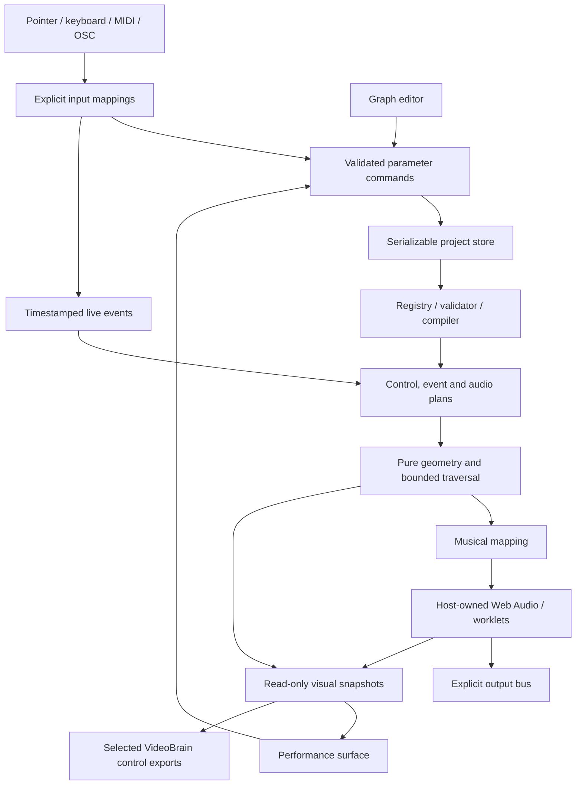

# AudioBrain architecture and design baseline

Status: AudioBrain 0.1.0 implements the three top-level instrument graphs, performance surface, native audio host, typed registry and scalar integrations. This document retains the broader approved design; sections marked planned are extension targets. [README](../README.md) lists current scope, [provenance](PROVENANCE.md) records actual adaptations, and [integration](INTEGRATION.md) defines the implemented bridge. Publication is a separate verified milestone.

## Product abstraction

AudioBrain builds instruments, processors, generative scores, controllers, and performance surfaces. An instrument need not be a synthesizer: L-System Mic can process incoming sound, a graph can emit MIDI without browser sound, and Shapes can control VideoBrain without any audio output.

The intended abstraction has three complementary levels. Version 0.1 implements domain nodes and primitives; instruments ship as complete expanded presets rather than nested module instances:

1. **Instrument module:** playable Shapes, L-Systems, or Graphs, with a graphic, a useful sound, and a small public parameter set.
2. **Domain nodes:** geometry generation, traversal, musical mapping, voice bank, microphone processor, mixer, and views. This is the normal construction level.
3. **Audio/control primitives:** oscillators, envelopes, filters, gain, arithmetic, and explicit converters. Expose these when useful; worklets and WASM are implementation backends, not the required user language.

Planned modules will be backed by those same domain nodes. In version 0.1, opening a preset already exposes its complete running structure. A cosmetic group around opaque legacy page code is an adapter stage, not an editable module.

## What VideoBrain supplies, and what changes

| Foundation | Source evidence | AudioBrain decision |
| --- | --- | --- |
| React 19, TypeScript, Vite, React Flow, Zustand | [package.json](https://github.com/blechdom/videobrain/blob/b7af64b1c1615eb521209b480856bff95b33a71f/package.json) | Use the same toolchain and initially the same tested lockfile baseline; rename package and app identities deliberately |
| Serializable graph and typed ports | [types.ts](https://github.com/blechdom/videobrain/blob/b7af64b1c1615eb521209b480856bff95b33a71f/src/graph/types.ts), [model.ts](https://github.com/blechdom/videobrain/blob/b7af64b1c1615eb521209b480856bff95b33a71f/src/graph/model.ts) | Preserve nodes/edges/stable IDs and transactional parsing; add namespaced document identity, assets, modules, and performance layout |
| One operator registry | [operators.ts](https://github.com/blechdom/videobrain/blob/b7af64b1c1615eb521209b480856bff95b33a71f/src/graph/operators.ts) | Same registry-driven controls, help, validation, capabilities, and catalog; audio domain and signal families become real definitions |
| Connection validation and topology | [compiler.ts](https://github.com/blechdom/videobrain/blob/b7af64b1c1615eb521209b480856bff95b33a71f/src/graph/compiler.ts) | Reuse algorithms; replace Display-only reachability and visual-only resource accounting with multi-root, multi-clock planning |
| Catalog/inspection protocol | [protocol.ts](https://github.com/blechdom/videobrain/blob/b7af64b1c1615eb521209b480856bff95b33a71f/src/graph/protocol.ts) | Preserve separate schema/catalog/protocol versions; inspect audio graph, module boundaries, event budgets, readiness, and control ownership |
| Controls, panels, editor and stories | [DESIGN_SYSTEM.md](https://github.com/blechdom/videobrain/blob/b7af64b1c1615eb521209b480856bff95b33a71f/docs/DESIGN_SYSTEM.md) | Reuse production components/tokens; add performance binding and layout, not a second component design system |
| WebGL visual tick | [WebGLRenderer.ts](https://github.com/blechdom/videobrain/blob/b7af64b1c1615eb521209b480856bff95b33a71f/src/engine/WebGLRenderer.ts) | Useful optional visualization backend; not the audio scheduler or state owner |
| CI and static publishing | [deploy-aws.yml](https://github.com/blechdom/videobrain/blob/b7af64b1c1615eb521209b480856bff95b33a71f/.github/workflows/deploy-aws.yml) | Mirror verification, Storybook publication, OIDC and artifact rollout with Audiobrain-specific resources |

VideoBrain currently exposes only `frame.rgba`, `control.f32`, and `text.utf8` wires. Buffered audio, event graph types, modules and MIDI/OSC graph nodes are not implemented there. The companion now supports explicit numeric-literal parameter mutations through its existing store; this is narrower than a general graph mutation API. Its stdio MCP inspects a supplied document; it cannot control an open browser. Do not advertise native interoperation merely because both repositories use a similar graph shape.

Initially keep one Audiobrain repository with clear internal boundaries. Extract a shared `brain-graph` or UI package only after both real consumers prove the shared API. Avoid a git submodule, runtime imports from a sibling directory, a wholesale fork of the visual renderer, or a backend requirement for ordinary sound generation. Record every copied/extracted source and any third-party license obligations when code migration begins.

## Ownership and execution

| State | Owner | Saved? |
| --- | --- | --- |
| Graph, literal parameters, seeds and performance layout | Project store through commands | Yes; module definitions/assets remain planned |
| Selection, editor viewport, active layout edit mode, fullscreen, capabilities, device handles, endpoint credentials | Session | No |
| Voices, AudioNodes, queues, transport epoch, phase, traversal frontier, audio buffers, meter snapshots, sockets | Runtime host | No |
| Optional captured automation or recorded media | Explicit recorder creates a project asset | Only on explicit capture/save |

Raw controller streams never write thousands of undo records or persist runtime values. A performer gesture edits a parameter through the same binding as the node control; a wired controller signal overrides the resolved runtime value while retaining the literal. Recording is an explicit operation. See [Contracts](CONTRACTS.md) for arbitration.

### Scheduling

The host owns one active `AudioContext`, an audio output gate, and a transport. Inject the context and outputs into migrated engines. Starting a voice must not allocate a second context or connect itself to `destination`.

The current implementation uses native Web Audio nodes and AudioBrain sine/FM voice adapters. A 25 ms host timer evaluates bounded musical events into a 100 ms lookahead, then translates transport time onto `AudioContext.currentTime`. Visuals consume snapshots from that host. No AudioWorklet, Worker or WASM backend is required by version 0.1; those remain options for later sample-critical processing.

The current transport tracks elapsed seconds against a monotonic host clock, with BPM available to transport/graph pulse evaluation. Shapes and L-System rates have explicit Hz or traversals/s parameters. Audio can be armed without resetting that transport. A full tempo map, general seek, network clock synchronization and exposed drift measurement remain planned. Internal runtime event types are defined in `src/runtime/types.ts`; the richer epoch-stamped public payloads in the contract design are extension targets.

Reset increments the epoch, releases notes and resets traversal state. Preset changes reset the instrument epoch while retaining an already armed/playing session; an unarmed session stays unarmed. Geometry is currently bounded and evaluated synchronously with memoization. Invalid non-destructive geometry edits retain the last valid evaluation; destructive incomplete cable edits silence the old routes until repaired.

Audio changes and graph rewiring need a resource diff keyed by stable node IDs. Reuse unaffected voices and effect state. Schedule parameter ramps; crossfade topology changes through a short gate instead of disconnecting a hot graph abruptly. Remove old resources after bounded tails or the crossfade. Never run two full unbounded graphs as an accidental consequence of React remounting.

### Roots and feedback

The current compiler treats Audio Out, MIDI/OSC/Brain Out, views and monitors as potential demand roots, and unions their upstream dependencies. The host separately gates actual audio/device effects on session activation. A view can demand geometry without arming audio; inactive authoring branches are excluded. Registered views continue to demand their snapshots when their UI is hidden. Capability/visibility pruning, recorders and general Data Out are later planning extensions.

Required ports fail validation; optional ports have documented silence/default behavior. Invalid edits preserve the last valid runtime plan and expose a diagnostic. The editor may retain an unfinished authoring graph.

Initially reject ordinary graph cycles, including control/mapping cycles. Delay and feedback effects retain internal state with bounded gain and delay. Later general feedback requires compiler support for read/commit boundaries; a node named Delay does not automatically make any cable loop valid. A graph-theory instrument may internally walk a cyclic topology: that topology is data, not an AudioBrain cable cycle.

## Modules and mixed granularity — planned

A module definition contains its graph, public input/output ports, public parameters, named views/actions, version, capabilities and budgets. A module instance stores a definition reference and its own parameter values/state identity. External bindings target the module's public interface, never guessed internal IDs.

`Shapes Instrument` can initially expose `pitch`, `speed`, `shape`, `audio`, `notes`, and `contour` view. Inside: geometry → reader → mapping → voices, with a separate graphics view. A user can replace the voice bank while retaining its graphical gesture. Multiple views can render the same math instance; mounting another view cannot duplicate a voice bank or restart a traversal.

Two operations must differ: **open** inspects/edits the selected module definition according to an explicit instance/shared scope; **expand to nodes** materializes a private copy and transactionally rewrites external edges and performance bindings. Both preserve public behavior and stable identity mappings. Do not promise automatic recovery of internal graphs from arbitrary legacy scripts.

## VideoBrain interoperability

Version 0.1 includes an explicitly paired, exact-origin `brain.control.v1` scalar bridge and a companion integration in VideoBrain. AudioBrain Brain Control Out publishes evaluated scalar snapshots. VideoBrain incoming mappings set selected numeric parameter literals through its production store; outgoing mappings publish selected saved numeric literals. Existing VideoBrain wires still override those literals. This does not add VideoBrain runtime output roots, event transport, audio streaming or transport-leader synchronization.

The apps pair as top-level windows using `postMessage`, a session nonce, ordered messages, allowlisted origins and a heartbeat. Session windows and adapters stay outside project JSON. The implementation does not assume cross-origin `BroadcastChannel` or iframe access. See [the implemented integration contract](INTEGRATION.md) for bounds, exact names, origin checks and connection steps.

A future runtime-to-runtime integration can add VideoBrain Control Out demand roots, explicit clock/authority mapping, geometric feature selectors and event channels. Actual audio sharing requires a separate media mechanism such as a same-host audio bus or negotiated WebRTC; raw audio buffers do not belong in this scalar protocol. Nested module portability is likewise separate from shared UI/graph conventions.

## Lessons translated into this design

| Evidence | AudioBrain conclusion |
| --- | --- |
| Max separates presentation placement from patch placement | Store performer layout separately while binding the same values; removing a widget preserves its node. [Max presentation](https://docs.cycling74.com/legacy/max8/vignettes/presentation_mode) |
| TouchDesigner channels declare sample rate and time slices can contain multiple samples between visual frames | Make time/rate boundaries inspectable and preserve event batches across slow rendering; do not label visual controls audio-rate. [CHOP](https://derivative.ca/UserGuide/CHOP), [Time Slicing](https://derivative.ca/UserGuide/Time_Slicing) |
| TouchOSC separates control values from MIDI/OSC/local message configurations | Give each transport an explicit mapping adapter and feedback rule. [TouchOSC messages](https://hexler.net/touchosc/manual/editor-messages) |
| Reaktor's instrument/macro/primitive hierarchy is a user-stated design reference | Offer whole instruments and domain-level internals. This is a proposed analogy; detailed NI manual retrieval was unavailable during this audit. |
| Web Audio already has an audio routing graph, scheduled sources, automation and worklets | Let the host compile audio connections into native nodes/worklets instead of copying sample blocks through React. [Web Audio Recommendation](https://www.w3.org/TR/2021/REC-webaudio-20210617/) |

These are design inferences, not format compatibility claims or reimplementations of those products.
