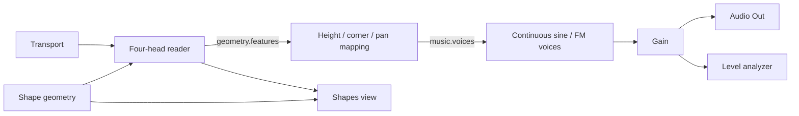
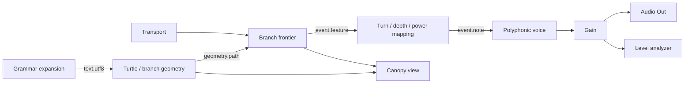
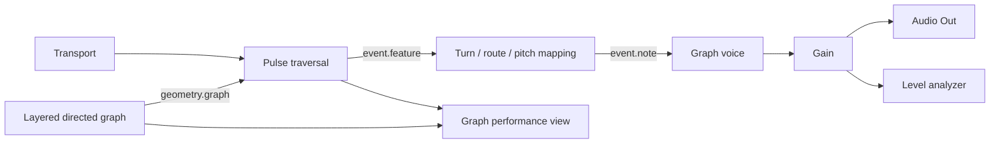

# Three teaching presets

Status: these are **playable production presets in AudioBrain 0.1.0**, validated by the production compiler and tested through real offline audio rendering. They adapt the audited instruments; they are not byte-for-byte exports or claims of full timbral parity. Future variations and richer authoring targets are identified below.

The expanded graphs in [presets/](../presets/) show the boundaries an author can edit. The current app presents each as a complete expanded instrument graph; nested module wrappers remain planned. A fresh session begins with audio off and built-in sources, without microphone/MIDI permission or network connections. The performer explicitly arms Audio and starts transport. Switching presets retains an already armed/playing session, resets the instrument epoch and releases old notes; it never arms an unarmed host. A persistent host transport and panic control sits outside the arrangeable widget list.

## 1. Morphazoid Shapes — continuous geometry as an instrument

**Learning goal:** separate geometric form, motion, musical mapping, sound and performance UI while retaining one visible causal loop.

| Part | Implemented starting point | What the performer learns |
| --- | --- | --- |
| Geometry | Five-sided polygon, curvature 0.15 | Form is data shared by the reader and graphic |
| Reader | Four heads, evenly spaced, 0.12 cycles/s | Head phase is persistent runtime state; drawing does not move sound |
| Mapping | 110 Hz root, two-octave height range; horizontal pan; directional corner envelope | Converting geometry into sound is an explicit replaceable node |
| Voice | Continuous voice bank, character 0.35 | Musical targets can drive different engines without replacing geometry |
| Output | Stereo gain -18 dB, level meter | Output level and metering are shared building blocks |
| Performance | Large contour graphic; sides, curvature, speed, root, character and level | Pinned controls edit the same literals as node/Inspector controls |

Arrange the shape view in the left two-thirds of a 12-column surface, expressive controls to the right, master/meter below. Dragging the shape graphic issues a curvature command through its explicit `viewBindings` target; keyboard/numeric equivalents remain available. Rotation and editable-vertex shapes need further declared parameters/actions, not capabilities implied by this fixture.

Acceptance: shape and sound respond to the same curve edit; corner articulation remains meaningful; another view adds no voices; hiding the view preserves sound; reset returns head phases reproducibly. Add a **Corner Drums** variation later: the same contact stream → crossing detector → event-to-drum mapping → drum bank. Continuous geometry features and discrete attacks must remain distinct contracts.

## 2. Morphazoid L-Systems — branches become a score

**Learning goal:** use the same branch structure for graphics, timing and pitch, with musical interpretation outside the grammar generator.

| Part | Implemented starting point | What the performer learns |
| --- | --- | --- |
| Grammar | Axiom `FX`; production `X → >[-FX]+FX<`; five iterations | Grammar can be edited without rewriting synthesis |
| Geometry | 45° turn, 0.72 length scale | A branched path retains parents, lengths, depth and cumulative turn |
| Frontier | Final-generation mode; half a normalized path traversal per second | Forks are evaluated together by path distance; visual X is not time |
| Mapping | 110 Hz root; turn-to-pitch mapping, branch power sharing and horizontal pan | More branches do not simply multiply gain |
| Voice/output | Polyphonic voice → stereo gain -18 dB → output and meter | Note events can be redirected to another compatible voice bank |
| Performance | Canopy graphic; angle, generation count, traversal speed, pitch and level | Structural changes publish complete revisions; other controls remain responsive |

The mapping parameter `semitonesPerTurn` means semitones per full cumulative revolution (2π radians); the adapter must translate the source's turn mapping explicitly. `speed` means traversals of the normalized path extent per second. These parameter units are not an assertion that similarly named legacy sliders use them.

Acceptance: growth/angle changes affect the actual generated branches; fork events keep their timing when rendering is slow; a replaced synth still receives valid paired note events; geometry overflow retains the last valid tree with a diagnostic. Add **Canopy Mic** as an explicit variant: Mic In → Branch Processor → Gain, with frontier → delay/rate/pan mapping → Branch Processor. It reuses the same geometry/frontier, requires a microphone start action, and also works with another instrument or a file as audio input.

## 3. Morphazoid Graphs — topology controls propagation

**Learning goal:** distinguish the instrument's graph from the patch graph, and expose topology, traversal, musical mapping and audio separately.

| Part | Implemented starting point | What the performer learns |
| --- | --- | --- |
| Topology | Layered, four layers, three nodes/layer, seed 17 | Directed routes are structured data independent of the outer patch cables |
| Traversal | Edge timing scale 0.15; canonical scheduling applies its distance curve | Geometry affects when an arrival sounds; branch/feedback budgets remain bounded |
| Mapping | 220 Hz root; 12 semitones per full cumulative turn | Route context, not just node number, can determine pitch |
| Voice | Canonical Graph Synth target mapping with AudioBrain sine/FM voice, decay 0.6 s | Preserve route-derived musical targets while keeping synthesis replaceable |
| Output | Stereo gain -18 dB with meter | The same output contract works for all three instruments |
| Performance | Large graph view with active-route overlay; edge time, pitch mapping, decay, level | The graphic's gesture explicitly targets edge time; node/edge authoring is the next view-action extension |

Remaining Graphs authoring target: add validated model-action bindings so toggling an edge changes future propagation and vertex dragging preserves IDs; seed/reset reproduces event order; a cyclic topology respects traversal limits without allowing illegal instantaneous patch cable cycles. The current preset defines generated topology and parameter gestures, not saved arbitrary vertex edits. Add **Graph Drums** by replacing arrival-to-note/voice nodes with drum mapping/bank. Add **Graph Audio Effect** separately for audio input → actual graph delay/retuning, sharing topology but not pretending that a synth event scheduler is a live audio processor.

## Cross-preset experiments

| Experiment | Explicit change | Boundary being tested |
| --- | --- | --- |
| Canopy played through Graph voice | Connect branch-note output to `voice.graph` instead of `voice.poly` | A musical note contract can outlive the original engine |
| Audio controls a visual | Level analyzer or LFO → range map → Brain Control Out; paired VideoBrain incoming mapping → selected numeric literal | Scalar bridge is implemented; direct geometric feature selection and VideoBrain runtime output roots remain planned |
| Same master on every instrument | Reuse gain, meter, output and shared parameter widgets | DSP state stays instrument/host-owned while components and contracts are reusable |
| Controller-driven shape | MIDI CC select → normalize/map → geometry parameter; UI shows resolved value | Controller data targets the parameter contract rather than DOM controls |
| Coarse and expanded form — planned | Add a nested instrument wrapper, then materialize its graph transactionally | Current presets already expose their expanded graphs; module instances are future work |

All controls and views reference stable IDs, as described in [Performance UI](PERFORMANCE_UI.md). The JSON files are production graph/parameter/layout documents. This page explains their teaching intent and explicitly names further authoring and instrument variations; it does not claim those variations are implemented.
