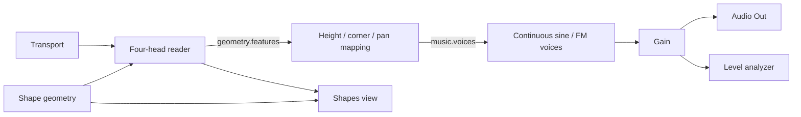
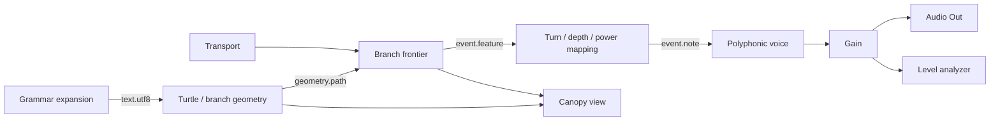
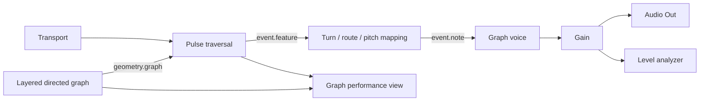

# Playing the presets

Open **Presets** in the project bar. **Load** replaces the current project; **Add** creates a second instrument with fresh stable IDs, internal connections and performance controls. Renaming an object never changes its identity.

| Shapes example | Sound | Readers |
| --- | --- | --- |
| Morphazoid Shapes / Shapes Synth | Continuous synth | Four point heads |
| Shapes Notes | Contour-region note attacks | Two crossing line heads, one reverse |
| Shapes Triggers | Morphazoid FM percussion, incidence mapping | Three radar heads |
| Shapes Drums | Morphazoid FM percussion, position mapping | Four point heads, mixed directions |

**Sound mode** is pinned on the performance surface. Notes and drum attacks follow entry into contour regions; **Trigger divisions** changes those regions. **Playheads** chooses each reader, direction, line axis and relative start. Each head can use its own reader type or inherit the main reader. New presets use zero curvature and −6 dB gain, with Notes at −3 dB and Drums at −9 dB. Saved project values remain unchanged.

Drag a head to reposition it. In the default Playheads tool, dragging inside a shape scrubs the shared phase and dragging outside rotates. The Move, Rotate and Curvature tools select explicit graphic gestures. Keyboard sliders and the pinned Rotation control provide alternatives.

Existing saved projects gain compatible reader/gesture defaults, but their authored performance layout is retained. Select Shapes Reader in Graph and pin **Playheads**; pin **Sound mode** from Shapes Mapping. When you change Sound mode in an older Synth patch, AudioBrain adds the optional Notes / triggers cable to its connected voice bank if that input is unused, in the same undo step. Existing input connections are preserved.

## Original Morphazoid presets

The library preserves 1,479 records across 126 source collections, including complete instrument patches, grammars, topology families, timbres, envelopes, scales, scenes and page defaults. Search by the original name or source page; filter by collection, type and availability. The first 48 matching cards appear immediately; **Show more** reveals the next page of results. Search always covers the entire collection.

| Availability | Current behavior |
| --- | --- |
| Graph ready: 11 L-System grammars | Rebuilds axiom, ordered rules, default iterations, angle, length scale, drawing/movement symbols and turn asymmetry into grammar and geometry nodes, with an AudioBrain note path and performance layout |
| Graph ready: 10 topology families | Uses the source graph generator and its coordinates, edges and entry identities, with editable topology, node count, density and seed; the preview uses AudioBrain traversal and sound |
| Needs features: other source records | Keeps all original data exportable and shows the missing adapter or engine; Load/Add become available only when faithful reconstruction is implemented |

The ten topology records are selectors for graph generators. Their source records do not define node count, density or seed; the AudioBrain preview starts at 12 nodes, 0.36 density and seed 17. Complete Graph instrument and delay patches include timing, tuning, drum/synthesis and feedback settings that need additional operators. Their data is preserved separately; a topology preview does not reproduce those instruments' original sound.

The archive is extracted from committed Morphazoid source at a pinned revision. Each record retains its original name, source ID, collection, exact settings, file hash and license notices. Tagged values preserve authored functions, undefined values and expressions that depend on the page viewport without executing source page code in the browser. The full archive downloads when an original record is first loaded, added or exported; the search index is available immediately.

This archive covers committed factory content and page defaults. Presets saved only in another site's browser storage or in private files need an explicit export from that app; the new site cannot read another origin's browser storage.

## Recipes and instances

Presets now have a page-independent `audiobrain.instrument-preset` document (schema version 1). A Morphazoid recipe holds its original settings and provenance. A versioned adapter reconstructs the graph, cables, parameter bindings and performance layout. Unknown settings and capacity overflows cause an explicit error; they are never silently dropped or reduced.

Reconstructing a source recipe creates fresh object IDs and a fresh preset instance ID. The project retains the source preset ID and full original recipe in `presetOrigins`, associated with that instance's nodes. **Add** remaps those associations with the rest of the instrument, so two copies can be edited independently while retaining their shared source identity. Deleting or duplicating a node updates the association; undo restores it. Original settings remain provenance while the live graph owns your edits. An authored graph recipe restores its saved IDs and can retain unfinished connections with their normal editor diagnostics.

Use **Export source preset** on any original card to keep its portable source recipe. Use **Presets → Export current as preset** to capture the complete current graph, including edits, layout and source associations. **Import preset or project** reconstructs supported source recipes or restores authored graph recipes. Imported unsupported source recipes report the missing features and preserve the current project. The existing project JSON export also retains all source associations. Exports remain subject to the project's 1 MiB bound.

`npm run check:presets` verifies the frozen source inventory, record hashes, original bank reconstruction and menu coverage. Runtime tests round-trip every source recipe and compare all supported grammar/topology geometry against canonical source fixtures. New adapters can extend reconstruction without revising or discarding the archived original data. [Archive maintenance](PRESET_ARCHIVE.md) documents extraction and the frozen source edition.

The following architecture notes distinguish implemented families from planned source extensions. The [parity ledger](FEATURE_PARITY.md) is the required preservation inventory.

# Three teaching presets

Status: these are **playable production presets in AudioBrain 0.3.0**, validated by the production compiler and tested through real offline audio rendering. They adapt the audited instruments; they are not byte-for-byte exports or claims of full timbral parity. Future variations and richer authoring targets are identified below.

The expanded graphs in [presets/](../presets/) show the boundaries an author can edit. The current app presents each as a complete expanded instrument graph; nested module wrappers remain planned. A fresh session begins with audio off and built-in sources, without microphone/MIDI permission or network connections. The performer explicitly arms Audio and starts transport. Switching presets retains an already armed/playing session, resets the instrument epoch and releases old notes; it never arms an unarmed host. A persistent host transport and panic control sits outside the arrangeable widget list.

## 1. Morphazoid Shapes — continuous geometry as an instrument

**Learning goal:** separate geometric form, motion, musical mapping, sound and performance UI while retaining one visible causal loop.

| Part | Implemented starting point | What the performer learns |
| --- | --- | --- |
| Geometry | Five-sided polygon, curvature 0 | Form is data shared by the reader and graphic |
| Reader | Four heads, evenly spaced, 0.12 cycles/s | Head phase is persistent runtime state; drawing does not move sound |
| Mapping | 110 Hz root, two-octave height range; horizontal pan; directional corner envelope | Converting geometry into sound is an explicit replaceable node |
| Voice | Continuous voice bank, character 0.35 | Musical targets can drive different engines without replacing geometry |
| Output | Stereo gain -6 dB, level meter | Output level and metering are shared building blocks |
| Performance | Large contour graphic; sides, curvature, speed, root, character and level | Pinned controls edit the same literals as node/Inspector controls |

Arrange the shape view in the left two-thirds of a 12-column surface, expressive controls to the right, master/meter below. Playhead, scrub, Move, Rotate and Curvature gestures issue validated commands through explicit `viewBindings`; keyboard/numeric equivalents remain available. Arbitrary editable-vertex shapes remain a separate authoring requirement.

Acceptance: shape and sound respond to the same curve edit; corner articulation remains meaningful; another view adds no voices; hiding the view preserves sound; reset returns head phases reproducibly. **Shapes Notes**, **Shapes Triggers** and **Shapes Drums** provide discrete attacks from the same contact stream through the mapping node and the voice bank's event input. Continuous geometry features and discrete attacks retain distinct contracts.

## 2. Morphazoid L-Systems — branches become a score

**Learning goal:** use the same branch structure for graphics, timing and pitch, with musical interpretation outside the grammar generator.

| Part | Implemented starting point | What the performer learns |
| --- | --- | --- |
| Grammar | Axiom `FX`; production `X → >[-FX]+FX<`; five iterations | Grammar can be edited without rewriting synthesis |
| Geometry | 45° turn, 0.72 length scale | A branched path retains parents, lengths, depth and cumulative turn |
| Frontier | Final-generation mode; half a normalized path traversal per second | Forks are evaluated together by path distance; visual X is not time |
| Mapping | 110 Hz root; turn-to-pitch mapping, branch power sharing and horizontal pan | More branches do not simply multiply gain |
| Voice/output | Polyphonic voice → stereo gain -6 dB → output and meter | Note events can be redirected to another compatible voice bank |
| Performance | Canopy graphic; angle, generation count, traversal speed, pitch and level | Structural changes publish complete revisions; other controls remain responsive |

The mapping parameter `semitonesPerTurn` means semitones per full cumulative revolution (2π radians); the adapter must translate the source's turn mapping explicitly. `speed` means traversals of the normalized path extent per second. These parameter units are not an assertion that similarly named legacy sliders use them.

Acceptance: growth/angle changes affect the actual generated branches; fork events keep their timing when rendering is slow; a replaced synth still receives valid paired note events; geometry overflow retains the last valid tree with a diagnostic. Add **Canopy Mic** as an explicit variant: Mic In → Branch Processor → Gain, with frontier → delay/rate/pan mapping → Branch Processor. It reuses the same geometry/frontier, requires a microphone start action, and also works with another instrument or a file as audio input.

## 3. Morphazoid Graphs — topology controls propagation

**Learning goal:** distinguish the instrument's graph from the patch graph, and expose topology, traversal, musical mapping and audio separately.

| Part | Implemented starting point | What the performer learns |
| --- | --- | --- |
| Topology | Layered, four layers, three nodes/layer, seed 17 | Directed routes are structured data independent of the outer patch cables |
| Traversal | Edge timing scale 0.15; canonical scheduling applies its distance curve | Geometry affects when an arrival sounds; branch/feedback budgets remain bounded |
| Mapping | 220 Hz root; 12 semitones per full cumulative turn | Route context, not just node number, can determine pitch |
| Voice | Canonical Graph Synth target mapping with AudioBrain sine/FM voice, decay 0.6 s | Preserve route-derived musical targets while keeping synthesis replaceable |
| Output | Stereo gain -6 dB with meter | The same output contract works for all three instruments |
| Performance | Large graph view with active-route overlay; edge time, pitch mapping, decay, level | The graphic's gesture explicitly targets edge time; node/edge authoring is the next view-action extension |

Remaining Graphs authoring target: add validated model-action bindings so toggling an edge changes future propagation and vertex dragging preserves IDs; seed/reset reproduces event order; a cyclic topology respects traversal limits without allowing illegal instantaneous patch cable cycles. The current preset defines generated topology and parameter gestures, not saved arbitrary vertex edits. Add **Graph Drums** by replacing arrival-to-note/voice nodes with drum mapping/bank. Add **Graph Audio Effect** separately for audio input → actual graph delay/retuning, sharing topology but not pretending that a synth event scheduler is a live audio processor.

## Cross-preset experiments

| Experiment | Explicit change | Boundary being tested |
| --- | --- | --- |
| Canopy played through Graph voice | Connect branch-note output to `voice.graph` instead of `voice.poly` | A musical note contract can outlive the original engine |
| Audio controls a visual | Level analyzer or LFO → range map → Brain Control Out; paired VideoBrain incoming mapping → selected numeric literal | Scalar bridge is implemented; direct geometric feature selection and VideoBrain runtime output roots remain planned |
| Same master on every instrument | Reuse gain, meter, output and shared parameter widgets | DSP state stays instrument/host-owned while components and contracts are reusable |
| Controller-driven shape | MIDI CC select → normalize/map → geometry parameter; UI shows resolved value | Controller data targets the parameter contract rather than DOM controls |
| Coarse and expanded form — planned | Add a nested instrument wrapper, then materialize its graph transactionally | Current presets already expose their expanded graphs; module instances are future work |

All controls and views reference stable IDs, as described in [Performance UI](PERFORMANCE_UI.md). The JSON files are production graph/parameter/layout documents. This page explains their teaching intent and explicitly names further authoring and instrument variations; it does not claim those variations are implemented.
